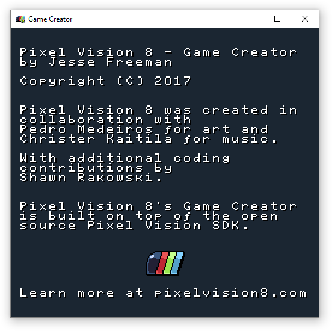

# Credits

Pixel Vision 8 was created by Jesse Freeman ([@jessefreeman](http://twitter.com/jessefreeman)) in collaboration with Pedro Medeiros ([@saint11](http://twitter.com/saint11)) for art and Christer Kaitila ([@McFunkypants](http://twitter.com/McFunkypants)) for music. With additional coding contributions by Shawn Rakowski ([@shwany](http://twitter.com/shwany)).


