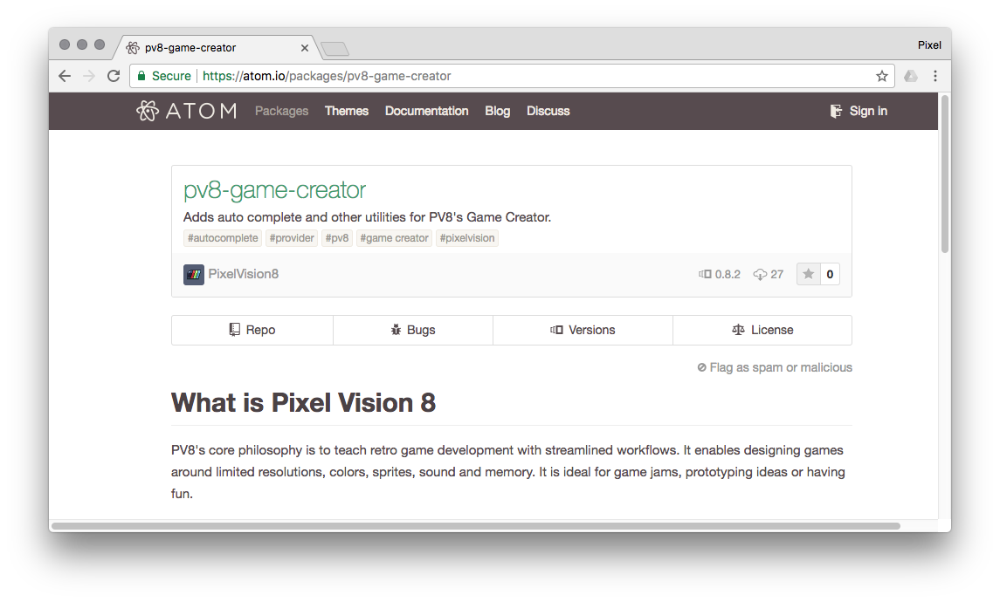

# Working with External Editors

The Game Creator was designed to operate in conjunction with your favorite external graphic and code editors. While there are tools built into the Game Creator, they were primarily designed to help debug and configure the engine, not create new content. With that in mind, the Game Creator is flexible enough to adapt its workflow to how you like to work. To get started, let’s talk a little more about the Workspace and the Game folder.

When you boot up the Game Creator, it automatically creates a workspace for you. This location is based on which OS you are running it on. You can see the Workspace’s path by going into the Workspace Explorer Tool.

From inside the Workspace Explorer Tool, you can get the path by clicking on the Copy button below the path window.

Once you have the path in the clipboard, just navigate to it on your computer, and you will have access to the Workspace on the filesystem.

You can learn more about how this folder works by reading the Workspace section of this book. Right now we are just going to focus on the Sandbox folder. When you begin editing a game, its contents are added to this folder making it easier for you work with. As an example, let’s edit the Tilemap Demo in the Workspace/Demos directory.

Once edit, you will see the projects contents inside of the Workspace/Sandbox directory in the Workspace Explorer.

Clicking Play will run the game and you’ll now have a copy of the Tilemap Demo ready to be modified.

Now if we look in the Workspace’s Game folder, we have access to all of the files that make up the game.

A normal Pixel Vision 8 game is comprised of two types of files: text, and png. The `code.lua`, `data.json` and `info.json` files are all text based and are editable in any flat text file editor you like such as Sublime Text, Notepad ++ or even Visual Studio Code. You can also load these .png images in Photoshop, Gimp, Aseprite or MS Paint if you wanted to. While the pro version the Game Creator includes tools for working with these files, each of them can be modified by hand and then reloaded at runtime to see the results.

If you are planning on coding with an external editor, you can install the Atom plugin which offers autocomplete on Pixel Vision 8’s APIs.

Simply install the plugin from inside of Atom’s settings menu.


