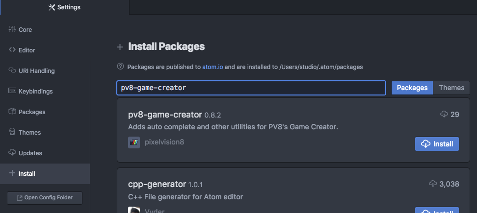
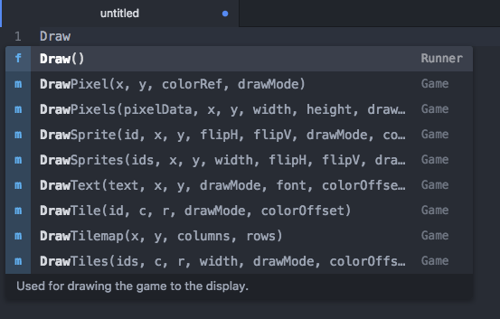
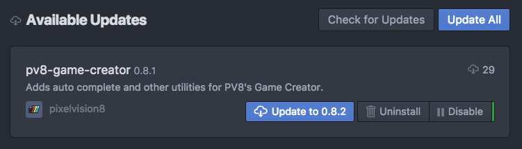
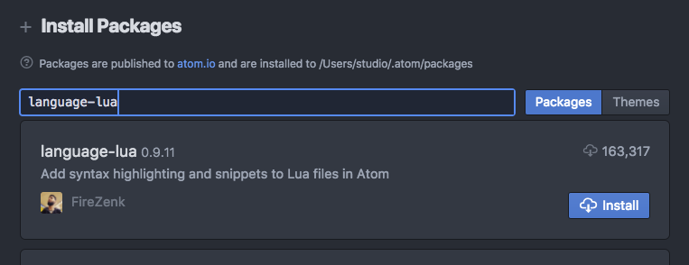

# Using the Atom IDE

Atom ([https://ide.atom.io](https://ide.atom.io)) is a great, lightweight code editor that works perfectly with the Game Creator. Due to the open nature of how projects are stored in the Workspace/Sandbox/ folder, any game you are editing in the Game Creator can also be worked on with external editors of your choice. Before you open your game’s Lua files in Atom, you will want to add a few plugins.

The first plugin you will want to install will be Pixel Vision 8’s Game Creator API autocomplete. You can install it by going to Atom’s settings then selecting the install tab. From there type in `pv8-game-creator` and search for the plugin.

Once installed, you will be able to get PV8 API code completion in any .lua file you work on in the editor.

Just start typing out the first 3 letters of a PV8 API and the autocomplete drop-down will give you the options to choose from. Each listing has a detailed description of what the API does, as well as an autocomplete template allowing you to tab through each of the arguments once you have hit returned and added the code snippet to your project.

Another advantage of installing the PV8 Game Creator plugin is that you can keep it up to date with each release.

This allows you to have the latest API autocomplete without having to dig through the documentation to see the latest changes.

You will also want to install a good Lua plugin if you have not done so already. I use `language-lua` by FireZenk.

There are lots of other great Atom plugins that can help you work with the Game Creator’s other data files. While the built-in text editor is good for making quick changes in a pinch, the ideal way to code PV8 game in the Game Creator is with an external code editor that you are comfortable using.


