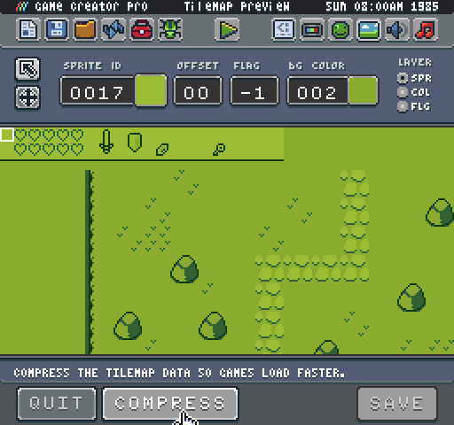
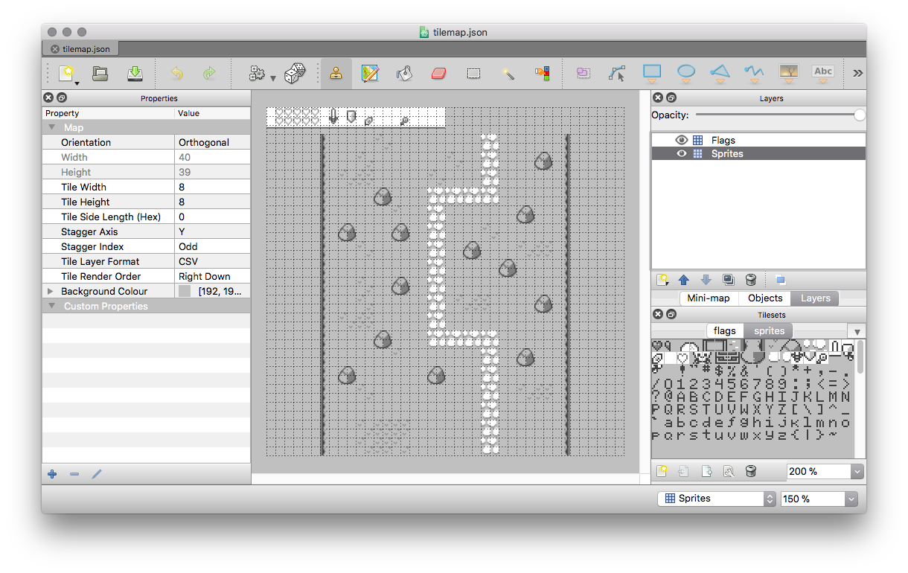
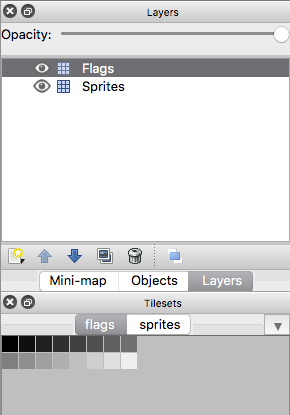
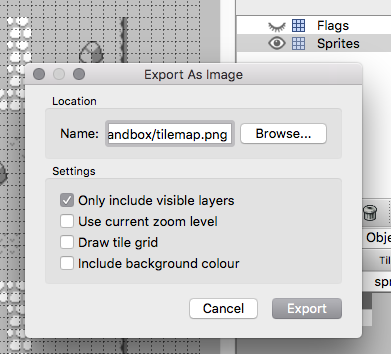

# Working with Tiled

The Game Creator has built-in support for Tiled ([http://www.mapeditor.org](http://www.mapeditor.org)) which is a free tool designed for creating tilemaps. The Game Creator’s built-in Tilemap Editor Tool will generate a Tiled JSON file and link it to your projects sprites automatically when you press the Compress button.

Once you compress the tilemap data, three new files will be created in your Sandbox folder: `flags.png`, `sprites.cache.png`, and `tilemap.json`.

You can now load up the tilemap.json file in Tiled. When you do, you will see two layers of the sprites and flags.

The Game Creator has automatically connected the Tiled project file to the resources in your Sandbox folder. The newly created sprites.cache.png is used for each tile, so it is important to note that any changes you make to your original sprite.png file will not show up in the Tiled project until you recreate the sprite cache. We will talk about how to keep these files in sync in just a bit.

The third file created when compressing the tilemap is the flags.png file. This allows you to create collisions in your tilemap while in Tiled. To do so, select the Flags layer and the flags tab for the tiles.

It is important to note that you should only draw flags on the Flags layer and sprites on the Sprites layer or you may have issues loading the tilemap back into the Game Creator. Now when you make any changes to your tilemap in Tiled, just hit save, and the Game Creator will now load your tilemap.json file while ignoring the tilemap.png file.

The final thing we should talk about is how to keep changes in sync. While it is best to only make changes to the tilemap after all of your sprites are finalized, that is not always an option. If you need to update the Tiled file with new sprites, you’ll need to perform a few steps for it to work. First, start by saving the layers of your Tiled project as a png.

Save the Sprites layer as `tilemap.png` and Flags as `tilemap-flags.png` separately. Make sure to hide the layer you are not saving, so there are no issues loading the two png files back into the Game Creator. 

Once you have a png backup of the changes to your tilemap, it is safe to delete the tilemap.json and sprites.cache.png file. Now you can go back into the Game Creator’s Tilemap Editor and reload the two png files you saved from Tiled. If everything looks good, compress the tilemap again, and it will generate a new sprites.cache.png with you are changes as well as a new tilemap.json file and you should be good to go.

One thing to note about this workflow is that it is possible for tiles to get out of sync, especially when you change them in the sprites.png but Tiled still relies on the old graphics. While it helps to read up on how the Game Creator parses tilemap.png data to match it up with a sprites.png you should be able to manually clean up the tilemap in Tiled if things do not look right.


