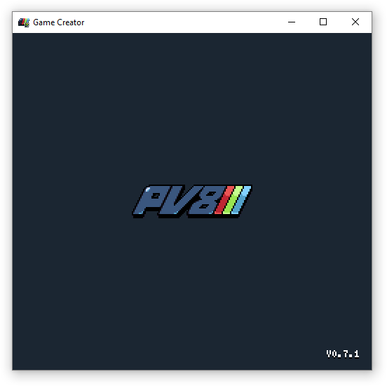
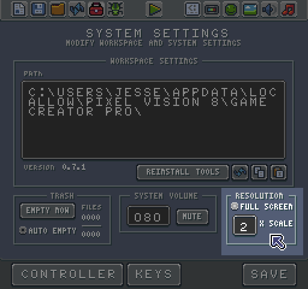
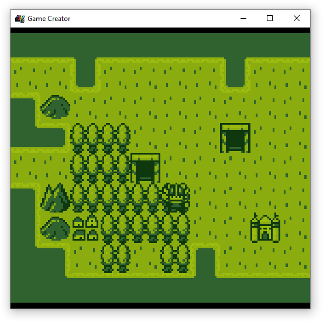

# Fullscreen and Windowed Mode

You can chose to run the Game Creator in fullscreen or windowed mode. By default, the Game Creator should boot up in windowed mode the first time you use it.

You can toggle this option in the Settings Tool. Here you will find an option to toggle fullscreen mode or set the window scale mode.

To apply your changes, you must hit the save button. At that time, the Game Creator switches into the fullscreen mode or scale the window.

When in windowed mode there are 4 scale options to chose. Scale mode 1 sets the resolution to 256 x 240 which is the Game Creator’s native resolution. Increasing the scale to 2 changes the window size to 512 x 280. The default scale is 2. You can not resize the Game Creator window manually. This scale mode system insures that games always look pixel perfect at the correct resolution. When going into fullscreen mode, the Game Creator automatically adjusts the scale mode based on your monitor’s current resolution.

 

One thing to note, when creating games at resolutions that are not 256 x 240, there are black bars displayed based on the game's suggested aspect ratio.

If you run into an issue with fullscreen or scale mode, you can manually change the values in the bios file. Simply search for `fullScreen `and `scale`:

If you change these values and restart the Game Creator it should adjust the display accordingly.


