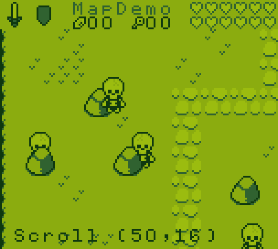
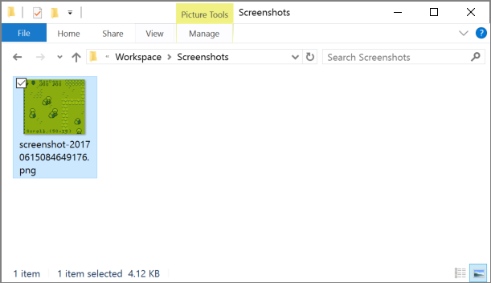
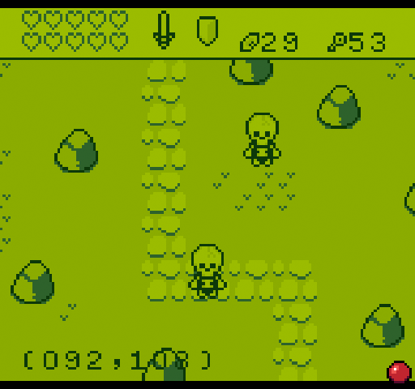

# Taking Screenshots

The Game Creator has a built-in keyboard shortcut for taking screenshots. You can take a screenshot of anything on the screen by pressing `Ctrl + 2`. Here is a screenshot from the tilemap demo.

When you press `Ctrl + 2`, your screenshot shows up in a new folder inside of the Workspace called Screenshots.

The Game Creator saves screenshots at the visible resolution of the display. In the case of the Tilemap Demo, the screenshot is 152 x 136. While the native resolution of the display is set to 160 x 144, there is an 8 pixel right and bottom overscan offset that is automatically cropped out. This ensures that when you take a screenshot, you do not accidentally capture any graphics or glitches that appear offscreen past the overscan border.

As of Game Creator v0.7.7 you can also take animated gif recordings of any game or tool you in. To activate gif recording, press `Ctrl+3` and you’ll see a record icon appear on the screen.

To stop recording, press `Ctrl+3` and you’ll see the record icon disappear. If you leave a game or tool, recording will automatically be stopped. Gif recordings appear in the Workspace/Screenshot folder when they are ready.

Gif recording is still experimental and not optimized. Try to limit your recordings to a few seconds. Since recordings are captured at the native resolution of the game, you may need to use an image editor to scale and optimized the final animated gif.


