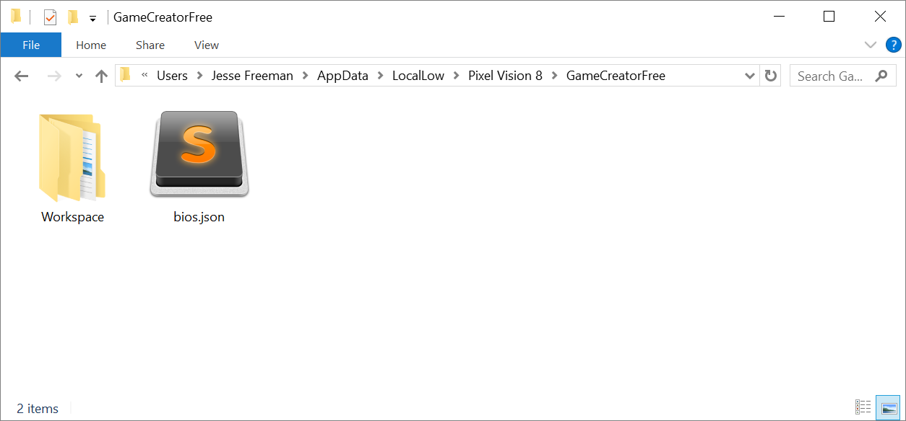
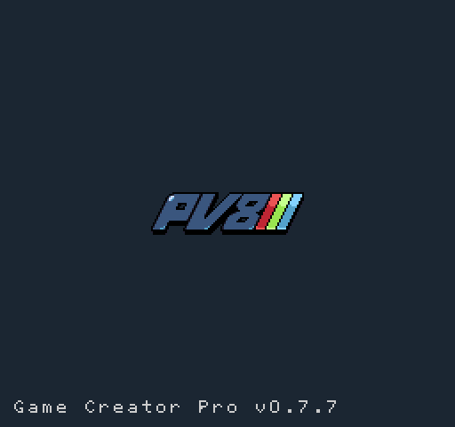

# Upgrading

The upgrade process should be straightforward. All of the built in tools, demos, systems and other critical files will be upgraded and you’re own Workspace will remain untouched. You should always backup your workspace before launching a new version of the Game Creator just in case. 

One last thing, you should take a moment to understand how releases are numbered. The Game Creator uses a standard versioning convention. For example, a build may look like this v0.7.0 which denotes the major version, minor version, and patch number.

Since the Game Creator is still in alpha, the major version is zero. Each new stable release increments the minor version. In between stable releases, are patches which help address bugs in the previous release. Patch versions are not well tested and should be considered "use at your own risk" builds until the next minor release is available.

If stability is a priority, stick to minor builds where the patch value is zero, 0.7.0a for example. Once Game Creator reaches the first major version, v1.0.0, it is considered beta, and at this point, all of the features are locked allowing development to shift focus on bug fixing and optimizations. At v2.0.0 the Game Creator is a release candidate allowing work to begin on the next round of features to help move the platform forward.


