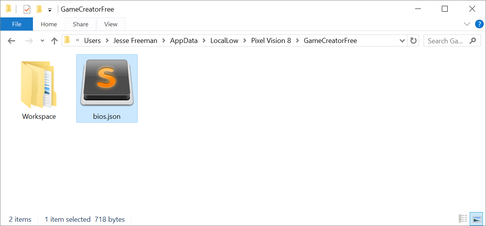
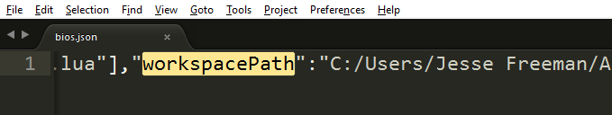
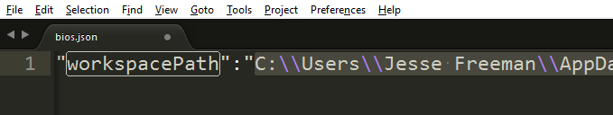

# Changing the Workspace Path

In addition to using Game Creator’s Workspace Explorer Tool, you can manually override the default system path by hand. Sometimes it is useful to change this if Pixel Vision 8 fails to load manually or the file becomes corrupted. The Game Creator stores the workspace path inside of the `bios.json`, at the root of the default, save location on your computer.

Inside it, search for workspacePath in the JSON and replace it with your path:

You can use forward slashes regardless of operating system. If you want to use backwards slashes on Windows make sure you escape them. 

You must restart Pixel Vision 8 if it is already running. Once reloaded, the Game Creator loads the new path as long as it is valid. If the directory is empty, the Game Creator generates a new Workspace.

When Pixel Vision 8 boots up, it analyzes the Workspace folder to make sure all the folders it needs exist. Also, it attempts to restore any of the core tools and built-in game examples you may have deleted from the Archive folder. 

By changing the path of the workspace by hand or with the Settings Tool, you can have multiple workspaces on your computer, as well as keep them under version control. However, PV8 can only work from a single workspace at a time.


