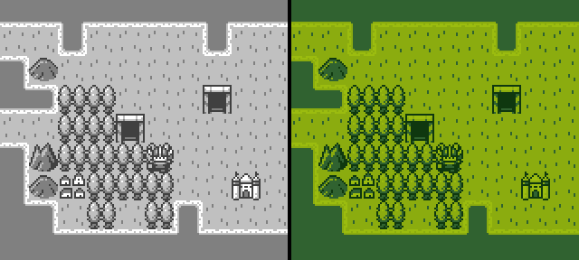

# Color Map

The color map allows the engine to better understand how to index sprite and tilemap PNGs. Without a `color-map.png`, the engine automatically attempts to use the system colors as the index. The color map allows you to work with any set of colors you want when making your game’s artwork and then re-map them to the system’s default colors. Let’s take a look at a few sprites and how their colors are indexed when imported:

Here you can see that these sprites contain four colors, not including transparency which is represented as magenta. They could work well with a Game Boy color palette, but that system uses four shades of green:

To fix this, we can create a color map that has the native sprite colors in the same order as the system colors, like this:

Now when the sprites are loaded up in memory, they will automatically use the correct system colors:

Here is an example of the color mapper being turned on and off:

As a best practice, you should always design your sprites in shades of gray and include a `color-map.png`. That way, the engine knows how to correctly parse your sprite and tilemap data since they both share the same graphic import parser. If the importer finds a `color-map.png` file, it is used to process any sprites or tilemap files loaded next.


