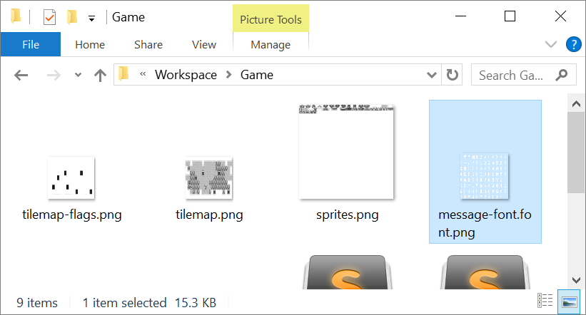
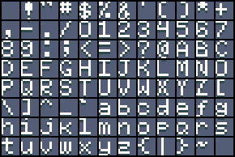

# Fonts

The Game Creator also supports for loading sprite fonts into memory. The characters of the font come from any file ending in `.font.png`. You can even have multiple fonts in a single game.

These files are similar to the` sprites.png`. Each character can be 8 x 8 and goes into any of the `GameChip`'s free memory slots. This means that you should always allow extra space in your `SpriteChip` to store fonts. In future versions of the Game Creator, a special font tool will help make this shared storage situation clearer.

Each character in the `.font.png` file should match up to their ASCII values. The parser starts at 32, which represents an empty space. Each character after that goes up in value. Here is a chart showing the breakdown of the default supported characters:

<table>
  <tr>
    <td>DEC</td>
    <td>Symbol</td>
    <td>Description</td>
    <td></td>
    <td>DEC</td>
    <td>Symbol</td>
    <td>Description</td>
  </tr>
  <tr>
    <td>32</td>
    <td> </td>
    <td>Space</td>
    <td></td>
    <td>80</td>
    <td>P</td>
    <td>Uppercase P</td>
  </tr>
  <tr>
    <td>33</td>
    <td>!</td>
    <td>Exclamation mark</td>
    <td></td>
    <td>81</td>
    <td>Q</td>
    <td>Uppercase Q</td>
  </tr>
  <tr>
    <td>34</td>
    <td>"</td>
    <td>Double quotes</td>
    <td></td>
    <td>82</td>
    <td>R</td>
    <td>Uppercase R</td>
  </tr>
  <tr>
    <td>35</td>
    <td>#</td>
    <td>Number</td>
    <td></td>
    <td>83</td>
    <td>S</td>
    <td>Uppercase S</td>
  </tr>
  <tr>
    <td>36</td>
    <td>$</td>
    <td>Dollar</td>
    <td></td>
    <td>84</td>
    <td>T</td>
    <td>Uppercase T</td>
  </tr>
  <tr>
    <td>37</td>
    <td>%</td>
    <td>Procenttecken</td>
    <td></td>
    <td>85</td>
    <td>U</td>
    <td>Uppercase U</td>
  </tr>
  <tr>
    <td>38</td>
    <td>&</td>
    <td>Ampersand</td>
    <td></td>
    <td>86</td>
    <td>V</td>
    <td>Uppercase V</td>
  </tr>
  <tr>
    <td>39</td>
    <td>'</td>
    <td>Single quote</td>
    <td></td>
    <td>87</td>
    <td>W</td>
    <td>Uppercase W</td>
  </tr>
  <tr>
    <td>40</td>
    <td>(</td>
    <td>Open parenthesis</td>
    <td></td>
    <td>88</td>
    <td>X</td>
    <td>Uppercase X</td>
  </tr>
  <tr>
    <td>41</td>
    <td>)</td>
    <td>Close parenthesis</td>
    <td></td>
    <td>89</td>
    <td>Y</td>
    <td>Uppercase Y</td>
  </tr>
  <tr>
    <td>42</td>
    <td>*</td>
    <td>Asterisk</td>
    <td></td>
    <td>90</td>
    <td>Z</td>
    <td>Uppercase Z</td>
  </tr>
  <tr>
    <td>43</td>
    <td>+</td>
    <td>Plus</td>
    <td></td>
    <td>91</td>
    <td>[</td>
    <td>Opening bracket</td>
  </tr>
  <tr>
    <td>44</td>
    <td>,</td>
    <td>Comma</td>
    <td></td>
    <td>92</td>
    <td>\</td>
    <td>Backslash</td>
  </tr>
  <tr>
    <td>45</td>
    <td>-</td>
    <td>Hyphen</td>
    <td></td>
    <td>93</td>
    <td>]</td>
    <td>Closing bracket</td>
  </tr>
  <tr>
    <td>46</td>
    <td>.</td>
    <td>Period, dot or full stop</td>
    <td></td>
    <td>94</td>
    <td>^</td>
    <td>Caret - circumflex</td>
  </tr>
  <tr>
    <td>47</td>
    <td>/</td>
    <td>Slash or divide</td>
    <td></td>
    <td>95</td>
    <td>_</td>
    <td>Underscore</td>
  </tr>
  <tr>
    <td>48</td>
    <td>0</td>
    <td>Zero</td>
    <td></td>
    <td>96</td>
    <td>`</td>
    <td>Grave accent</td>
  </tr>
  <tr>
    <td>49</td>
    <td>1</td>
    <td>One</td>
    <td></td>
    <td>97</td>
    <td>a</td>
    <td>Lowercase a</td>
  </tr>
  <tr>
    <td>50</td>
    <td>2</td>
    <td>Two</td>
    <td></td>
    <td>98</td>
    <td>b</td>
    <td>Lowercase b</td>
  </tr>
  <tr>
    <td>51</td>
    <td>3</td>
    <td>Three</td>
    <td></td>
    <td>99</td>
    <td>c</td>
    <td>Lowercase c</td>
  </tr>
  <tr>
    <td>52</td>
    <td>4</td>
    <td>Four</td>
    <td></td>
    <td>100</td>
    <td>d</td>
    <td>Lowercase d</td>
  </tr>
  <tr>
    <td>53</td>
    <td>5</td>
    <td>Five</td>
    <td></td>
    <td>101</td>
    <td>e</td>
    <td>Lowercase e</td>
  </tr>
  <tr>
    <td>54</td>
    <td>6</td>
    <td>Six</td>
    <td></td>
    <td>102</td>
    <td>f</td>
    <td>Lowercase f</td>
  </tr>
  <tr>
    <td>55</td>
    <td>7</td>
    <td>Seven</td>
    <td></td>
    <td>103</td>
    <td>g</td>
    <td>Lowercase g</td>
  </tr>
  <tr>
    <td>56</td>
    <td>8</td>
    <td>Eight</td>
    <td></td>
    <td>104</td>
    <td>h</td>
    <td>Lowercase h</td>
  </tr>
  <tr>
    <td>57</td>
    <td>9</td>
    <td>Nine</td>
    <td></td>
    <td>105</td>
    <td>i</td>
    <td>Lowercase i</td>
  </tr>
  <tr>
    <td>58</td>
    <td>:</td>
    <td>Colon</td>
    <td></td>
    <td>106</td>
    <td>j</td>
    <td>Lowercase j</td>
  </tr>
  <tr>
    <td>59</td>
    <td>;</td>
    <td>Semicolon</td>
    <td></td>
    <td>107</td>
    <td>k</td>
    <td>Lowercase k</td>
  </tr>
  <tr>
    <td>60</td>
    <td><</td>
    <td>Less than</td>
    <td></td>
    <td>108</td>
    <td>l</td>
    <td>Lowercase l</td>
  </tr>
  <tr>
    <td>61</td>
    <td>=</td>
    <td>Equals</td>
    <td></td>
    <td>109</td>
    <td>m</td>
    <td>Lowercase m</td>
  </tr>
  <tr>
    <td>62</td>
    <td>></td>
    <td>Greater than</td>
    <td></td>
    <td>110</td>
    <td>n</td>
    <td>Lowercase n</td>
  </tr>
  <tr>
    <td>63</td>
    <td>?</td>
    <td>Question mark</td>
    <td></td>
    <td>111</td>
    <td>o</td>
    <td>Lowercase o</td>
  </tr>
  <tr>
    <td>64</td>
    <td>@</td>
    <td>At symbol</td>
    <td></td>
    <td>112</td>
    <td>p</td>
    <td>Lowercase p</td>
  </tr>
  <tr>
    <td>65</td>
    <td>A</td>
    <td>Uppercase A</td>
    <td></td>
    <td>113</td>
    <td>q</td>
    <td>Lowercase q</td>
  </tr>
  <tr>
    <td>66</td>
    <td>B</td>
    <td>Uppercase B</td>
    <td></td>
    <td>114</td>
    <td>r</td>
    <td>Lowercase r</td>
  </tr>
  <tr>
    <td>67</td>
    <td>C</td>
    <td>Uppercase C</td>
    <td></td>
    <td>115</td>
    <td>s</td>
    <td>Lowercase s</td>
  </tr>
  <tr>
    <td>68</td>
    <td>D</td>
    <td>Uppercase D</td>
    <td></td>
    <td>116</td>
    <td>t</td>
    <td>Lowercase t</td>
  </tr>
  <tr>
    <td>69</td>
    <td>E</td>
    <td>Uppercase E</td>
    <td></td>
    <td>117</td>
    <td>u</td>
    <td>Lowercase u</td>
  </tr>
  <tr>
    <td>70</td>
    <td>F</td>
    <td>Uppercase F</td>
    <td></td>
    <td>118</td>
    <td>v</td>
    <td>Lowercase v</td>
  </tr>
  <tr>
    <td>71</td>
    <td>G</td>
    <td>Uppercase G</td>
    <td></td>
    <td>119</td>
    <td>w</td>
    <td>Lowercase w</td>
  </tr>
  <tr>
    <td>72</td>
    <td>H</td>
    <td>Uppercase H</td>
    <td></td>
    <td>120</td>
    <td>x</td>
    <td>Lowercase x</td>
  </tr>
  <tr>
    <td>73</td>
    <td>I</td>
    <td>Uppercase I</td>
    <td></td>
    <td>121</td>
    <td>y</td>
    <td>Lowercase y</td>
  </tr>
  <tr>
    <td>74</td>
    <td>J</td>
    <td>Uppercase J</td>
    <td></td>
    <td>122</td>
    <td>z</td>
    <td>Lowercase z</td>
  </tr>
  <tr>
    <td>75</td>
    <td>K</td>
    <td>Uppercase K</td>
    <td></td>
    <td>123</td>
    <td>{</td>
    <td>Opening brace</td>
  </tr>
  <tr>
    <td>76</td>
    <td>L</td>
    <td>Uppercase L</td>
    <td></td>
    <td>124</td>
    <td>|</td>
    <td>Vertical bar</td>
  </tr>
  <tr>
    <td>77</td>
    <td>M</td>
    <td>Uppercase M</td>
    <td></td>
    <td>125</td>
    <td>}</td>
    <td>Closing brace</td>
  </tr>
  <tr>
    <td>78</td>
    <td>N</td>
    <td>Uppercase N</td>
    <td></td>
    <td>126</td>
    <td>~</td>
    <td>Equivalency sign - tilde</td>
  </tr>
  <tr>
    <td>79</td>
    <td>O</td>
    <td>Uppercase O</td>
    <td></td>
    <td>&nbsp</td>
    <td>&nbsp</td>
    <td>&nbsp</td>
</tr>
</table>

While you can arrange your `.font.png` character sprites in any 8 x 8 grid-based layout, it is best practice to follow this template:

While the default template only supports the standard English character set, special characters can also be added to the template; they will be parsed and assigned an ASCII ID exactly like the main set of characters.

