# The Sprite Builder

While the Game Creator offers several features that help make importing 8 x 8 sprites easier, some games require larger sprites. Built into the Game Creator is a feature which helps streamline converting lots of smaller 8 x 8 sprites into larger collections of sprites you can use at run-time. Coupled with some built in APIs for rendering multiple sprites at once, it is possible to take advantage of this particular workflow in your development.

To get started using the Sprite Builder, simply create a new folder in the root of your Workspace called SpriteBuilder.

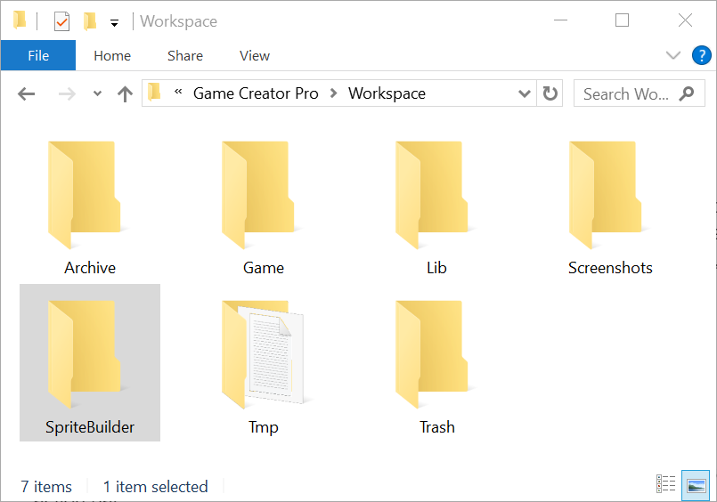

Once you have created this folder, a new button appears at the bottom of the Sprite Tool's action bar.

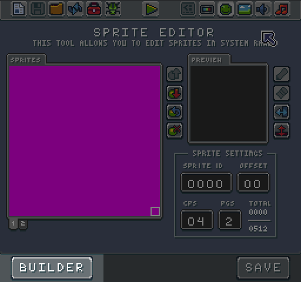

The Sprite Builder folder allows you to store large sprites and import them into your game. The Sprite Builder tool looks at the makeup of each png inside of the folder and attempts to match every 8 x 8 block of pixels to an existing sprite. The results are converted into Lua tables and injected into your `code.lua` file. Let's take a look at how this works.

Here we have a collection of sprites that make up all of the artwork for our game.

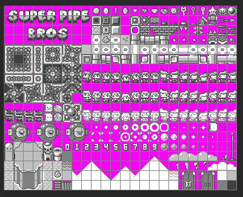

These were designed and laid out in Photoshop. Since the game is still in development, it is easier to work with all of the sprites like this. As one large image they are easy to modify and update as needed. But when we save this to the Game folder as our `sprites.png` file, the importer optimizes them in memory. 

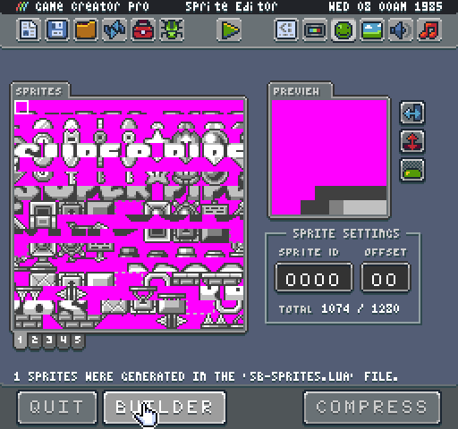

Each sprite gets a unique ID, and we could use this ID to rebuild them in the game. Our player, for example, is made up of 6 sprites. 

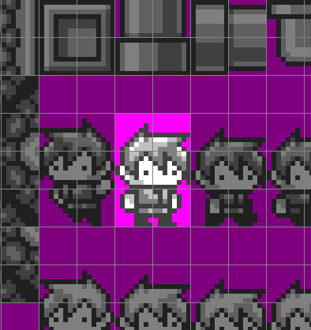

While we could simply find each ID and manually draw them to the display, over time this workflow breaks down. First, the order of sprite may change depending on alterations made to the underlying `sprites.png` image. Second, finding the IDs of all the sprites by hand is time-consuming. Finally, managing all of these resources becomes frustrating, and the goal of Game Creator is to make games, not manager artwork!

To leverage the Sprite Builder, we need an image. We'll isolate the first animation for the player and put that into the SpriteBuidler folder.

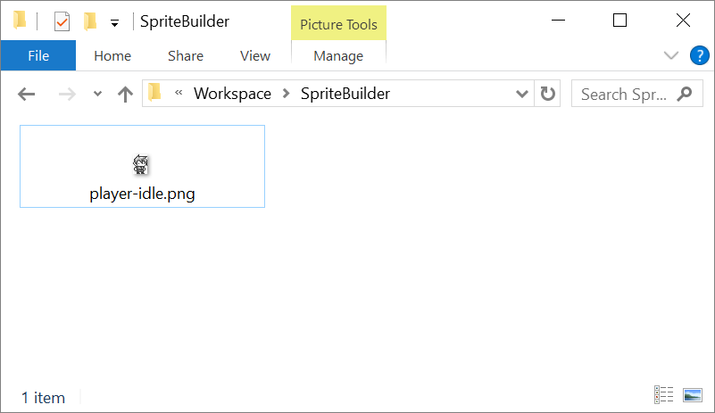

Now back in the Sprite Tool, we can press the Build button, and Sprite Builder analyzes the contents of the SpriteBuilder folder and generates sprite IDs for use in the `code.lua` file. 

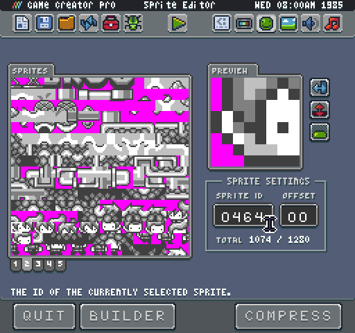

Let's take a look at the output of the newly created `sb-sprites.lua` file inside of your game folder:

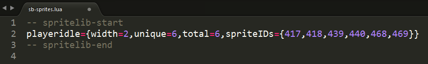

Here you can see we now have a new Lua table named after the png in the SpriteBuilder folder. We also get the size of the sprite, the IDs and a reference to the total amount of unique sprites. To include this sprite in our game, we’ll need to add the following to our code.lua file:

	LoadScript("sb-sprites.lua")

This will include all of the code inside of the `sb-sprites.lua` file. It’s important to do this towards the top of your game code so it is accessible to the rest of your game. Now, if we wanted to draw this sprite, we could simply call `DrawSprites()` and pass in the data like so:

	DrawSprites(playeridle.spriteIDs, 0, 0, playeridle.width, false, false, true, 0)

The DrawSprites() method allows you to render larger sprites that are laid out in a grid. Simply give this method the sprite IDs and the width to render any size sprite you want. Just keep in mind that each sprite ID counts towards your maximum sprites on the screen cout defined by the system’s specs.

At this point, you can probably see the potential of the Sprite Builder tool. Just dump collections of images into this folder and auto generate data for all of your larger sprites. Here I am using Photoshop's slice feature to cut up each sprite, and I can use Save for Web to generate all the png files I need.

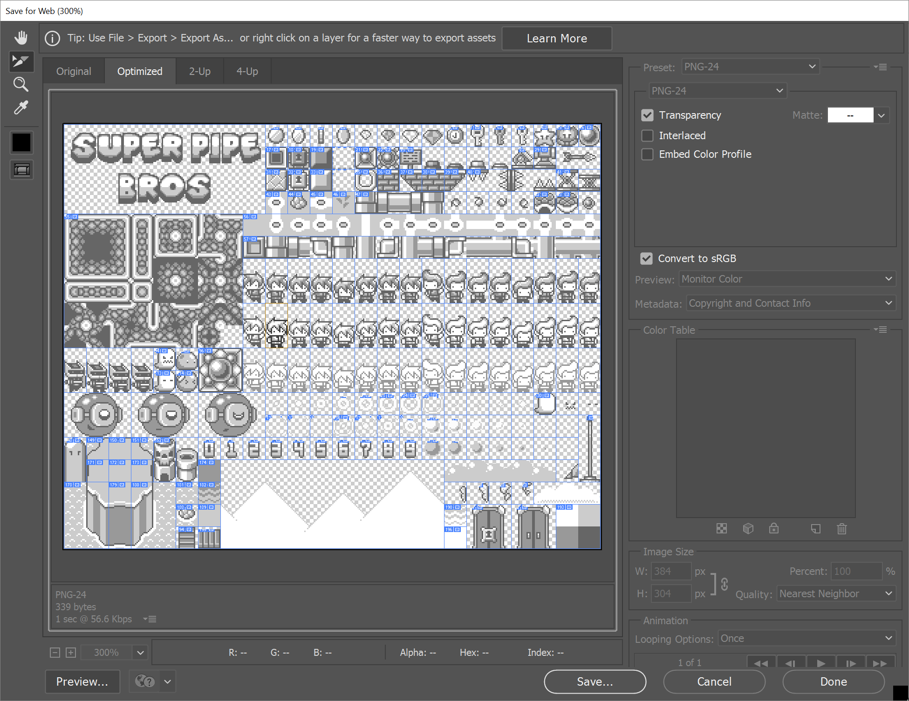

This is what Photoshop exports to the SpriteBuilder folder.

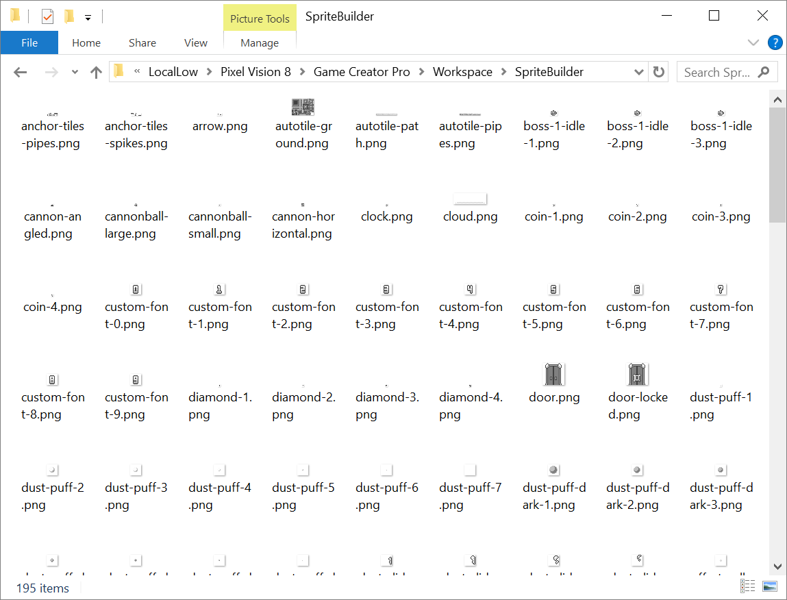

Once I have all the file in the SpriteBuilder folder, I can inject the data and reference my sprites by their name instead of the ID.

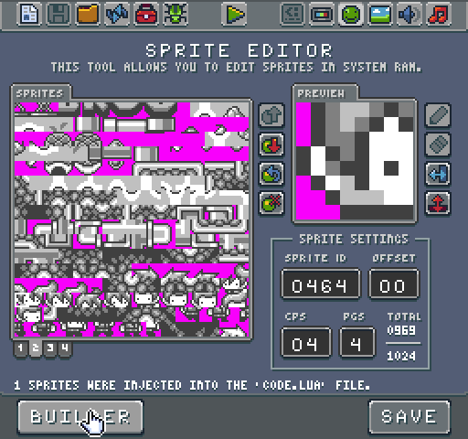

If anything changes in the source image, I can re-export out all of my images to the SpriteBuilder folder and regenerate the data. Since my code references the sprite name instead of the ID, my code continues to work as I modify all of the artwork during development.

The Sprite Builder is a very powerful tool and was used to generate all of the sprite data for each tool. Feel free to open up any of the tool projects, and look at the generated sprite data at the top of each code.lua file for a better idea of how to leverage this feature in your own game.


