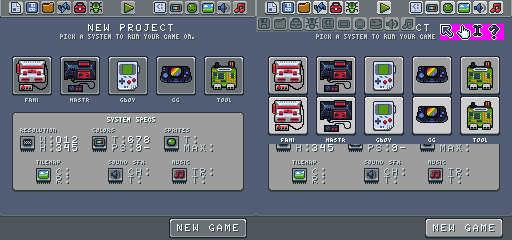
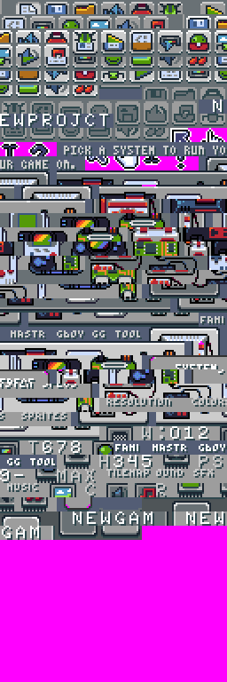
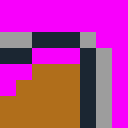
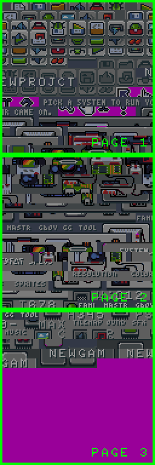
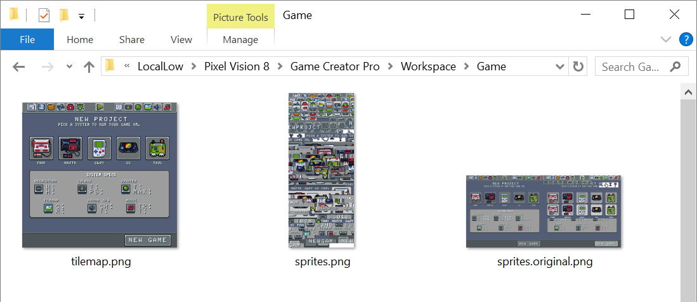
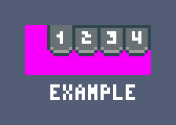
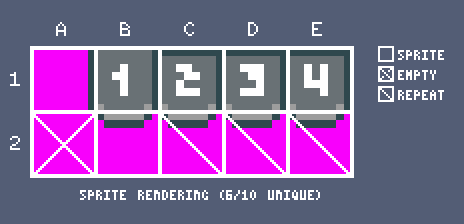

# Sprite Data

When games load, the engine looks for a sprite.png to process. The sprite.png can be used to load sprite data into memory and is made available as an option for those using external image editors to work on their graphics. The .png is cut up into 8x8 chunks of pixel data, which represent individual sprites in memory. Since sprites are simply collections of references to color IDs, the system attempts to match those colors to what exists in the system already or to a color map. It’s critical that the colors of in your sprite.png match up to the same colors found in the color.png for the importer to work. One the importer is done converting a sprite's pixel data; the Sprite Chip stores the compressed data in a memory slot which becomes its ID.

## Importing Sprites

In addition to processing the sprite.png image and converting it to indexed color data, the Sprite Chip also optimizes the data by only storing unique sprites. Let’s take a look at a sample sprite.png from the New Game Tool. Here you can see we have two UI screens laid out next to each other as a 512 x 240 pixel sprite.png image. If the Sprite Chip imports all of the sprites as is, we end up 1,920 sprites:

Since PV8 only supports 8 x 8 pixel sprites, the importer works through the sprite.png file, starting in the upper left-hand corner, converting each 8 x 8 pixel block of data into a format the Sprite Chip can store. As it works through the pixel data, the importer removes repeating sprites to optimize the amount of space the Sprite Chip has left. You can see how this works by examining what the Sprite Chip now contains:

The importer automatically optimizes the sprites.png leaving us with 602 sprites, which is a 68% reduction. It is also important to note that transparent pixel data is ignored and converted to the system’s default mask color which is magenta (#FF00FF). PV8 does not store transparent colors. Any colors not available to the system, including transparency, is simply not drawn to the display. However, you can use transparent colors when importing sprites as long as your understand they will be masked when being used inside of the rendering engine.

## Colors Per Sprite

While the Sprite Chip imports each sprite, it analyzes the total number of colors and compares this to what the chip can display. An 8 x 8 pixel sprite can have a maximum of 64 unique colors, but older 8-bit systems are unable to display that many colors at once. To simulate this, the Sprite Chip has a property that represents the total colors per sprite, or CPS for short. While this value can be increased or decreased based on your needs, the reduced number of sprite colors is a hallmark of classic 8-bit systems and their memory limitations around drawing sprites to the display. 

While processing sprites, the importer calculates if each one contains more colors than are allowed. When this happens, additional colors are converted to the internal transparency color and forcing the sprite to adhere the Sprite Chip's CPS limitation. Here is an example of how this works with an 8 color sprite:

If we reduce the CPS to 3 you begin losing pixel data:

Understanding how CPS works is critical to importing pixel data into the Sprite Chip.

## Sprite Memory Pages

Keep in mind that the Pixel Vision 8 also places limits on the number of sprites it can store in memory. While technically the engine can support any .png that is divisible horizontally and vertically by eight, it helps to optimize your art based on sprite pages, which is how the internal system stores and calculates the total sprites available.

A single sprite page is 128x128 pixels, which contains 256 sprites. When you are configuring the system, you can define how many pages the Sprite Chip supports. The maximum number of pages is eight, with a potential total of 2,048 sprites. Here is a breakdown of how sprite pages scale:

<table>
  <tr>
    <td>Pages</td>
    <td>Total Sprites</td>
  </tr>
  <tr>
    <td>1</td>
    <td>256</td>
  </tr>
  <tr>
    <td>2</td>
    <td>512</td>
  </tr>
  <tr>
    <td>3</td>
    <td>768</td>
  </tr>
  <tr>
    <td>4</td>
    <td>1,024</td>
  </tr>
  <tr>
    <td>5</td>
    <td>1,280</td>
  </tr>
  <tr>
    <td>6</td>
    <td>1,536</td>
  </tr>
  <tr>
    <td>7</td>
    <td>1,792</td>
  </tr>
  <tr>
    <td>8</td>
    <td>2,048</td>
  </tr>
</table>

One way to help optimize your sprites is to store them in page blocks before importing. Let's look back at the earlier example with the imported New Game Tool sprites. If we were to export the sprites from the Sprite Chip, we would end up with a 256 x 768 image: 

Here you can see how each page of sprites is broken up. Since the importer works from the top left of the sprite.png to the right as it traverses each row of pixels, this is the most optimized way to store sprites ready to be imported.

When building a game, don't focus on optimizing your sprite.png at first. While you may see slower load times, simply work on your sprites in a way that makes sense to you. Before sharing the game, simply dump the Sprite Chip's memory to a png file after importing your original sprite.png, and you can use that as the optimized file. Here is an example of how I organize the sprites inside the tool files:

As you can see, I keep two sprite files. The first is the sprites.original.png which is ignored by the importer but allows me to still work with sprites in my image editor of choice. For running the game, I use the optimized file as the main sprite.png.

## Working With Large Sprites

Even though Pixel Vision 8 can only support rendering 8x8 sprites, you can still use larger sprites in your game. To do this, you will need to combine those sprites at run-time. Let's take a look at some sample UI:

Here you can see we have the pagination buttons. In this example, we have a 5 x 2 grid with a total of 10 sprites: 

Some of these sprites repeat or are empty, which helps cut down on the total number of sprites that are stored in memory. You will see that we have six unique sprites, but we still need nine sprites to render, ignoring the one empty sprite in A2.

Just keep in mind that the system has a limit on the number of sprites it can draw to the display, so the larger your sprites, the less you may have to display other elements in the end. You can also leverage the tile map to gain an additional area to render larger tiles that don’t need to move around the screen.


