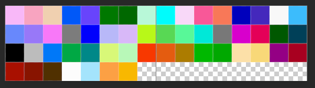
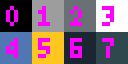
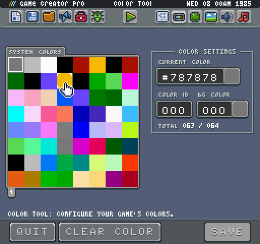

# System Colors

Each system template includes a set of default colors inside of a `colors.png` file. This file represents all of the colors availble at runtime and contains one color per pixel. The Game Creator reads through each color and loads it into the ColorChip when loading a game.

The color importer scans the PNG’s color data a pixel at a time, starting in the upper-left corner and ending in the bottom right, saving each color until reaching the color limit. You can always change the `supportedColors `value in the `data.json` file or through the Display Tool. 

To create your `color.png` file by hand, simply create a single line of pixels or lay them out in a grid. Here is an example of how the color importer traverses a grid of pixels inside of a color.png file:

Any colors over the `supportedColors `value will be ignored. The order of the colors in the PNG will match how they are stored in memory. Once you know their ID, you can reference them as needed like setting the background color value.

The Display Tool is designed to make it easier to work with a game’s colors:

This tool allows you modify any of the current colors that have been loaded and change the limitation of the Color Chip. You can also export a new color.png file to the Game directory when you want to save your changes.

One important thing to note about a game’s colors is that they are used to read the sprite and tilemap data. If a color does not exist in the system before importing sprites and tilemap, it may be missing in the final sprite data saved to memory. Missing color data also impacts how sprites load, their ID in memory and if they even show up. It is critical that you always provide a complete set of system colors used by your game's artwork for it to load properly.


