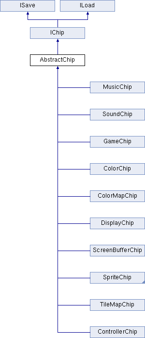

# System Data

The `data.json` file is perhaps the most important file in the load process. It contains all of the chips, a core component of the engine, which define the specs for configuring PV8 to play the game. Here is a breakdown of the main chips built into the engine:

Since the `data.json` contains information on which chips the system should use, as well as properties like the system colors, number of colors per sprite and more, this file defines how the actual engine and the rest of the files are loaded into memory.

Here is a sample of what a typical data.json file looks like:

    {
        "PixelVision8.Chips.ColorChip":
        {
            "pages":1,
            "supportedColors":4,
            "transparent":"#FF00FF"
        },
        "PixelVision8.Chips.SpriteChip":
        {
            "spriteWidth":8,
            "spriteHeight":8,
            "pages":4,
            "cps":4
        },
        "PixelVision8.Chips.DisplayChip":
        {
            "wrapMode":1,
            "width":160,
            "height":144,
            "autoClear":1,
            "maxSpriteCount":40
        },
        "PixelVision8.Chips.TileMapChip":
        {
            "columns":32,
            "rows":30,
            "totalFlags":16
        },
        "PixelVision8.Chips.SoundChip":
        {
            "totalChannels":4,
            "sounds": [
                ...
            ]
        },
        "PixelVision8.Chips.MusicChip":
        {
            "totalTracks":3,
            "notesPerTrack":127,
            "songs":[
                ...
            ]
        },
        "PixelVision8.Chips.LuaGameChip":
        {
            "maxSize":128,
            "saveSlots":8,
            "savedData":{
                ...
            }
        }
    }

Each block of data in the `.json` file defines a chip for the engine to initialize and its settings. Let’s take a look at the `SpriteChip `and how it gets serialized. The first line of the JSON object is the engine’s qualified class name: 

    "PixelVision8.Chips.SpriteChip": {

When this parses, the `ChipManager `automatically creates an instance of this class. Next are properties that can be configured on the chip. Only a handful of properties can be configurable in the `.json` file. Here are the four main properties of the `SpriteChip`:  

    "spriteWidth":8,
    "spriteHeight":8,
    "Pages":4,
    "cps":4

After the chip is deserialized, the JSON properties are passed to a special method that all chips share and the values for each property are set. In this chip, you can change the size of sprites system-wide, as well as the memory size where sprites are stored. By default, sprite RAM can store 16 columns and 16 rows of sprites for a total of 256 sprites per page.

While you can manually change values in this file, it’s best not to do so unless you know exactly what you are doing. The underlying engine that runs PV8 is incredibly open and allows for all kinds of customization. The Game Creator, however, has a lot of restrictions on top of it to better adhere to the predefined limitations of the fantasy consoles it attempts to emulate. Use caution when modifying this file.

