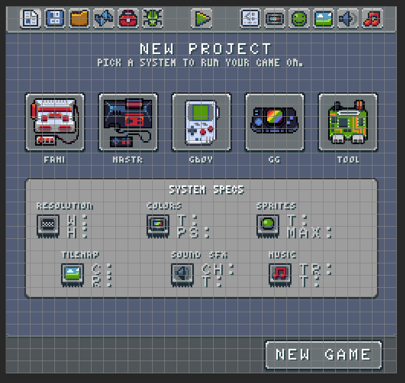
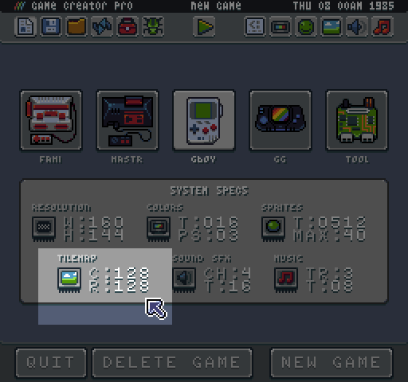

# Tilemap

The tile map works similar to the sprite.png. Since tile maps are simply compressed data structures representing sprite IDs in a grid, the image is cut up into 8 x 8 tiles and that pixel data is compared to existing sprites in memory. 

For the tools, they have a resolution of 256 x 240 pixels, which equates to 32 sprites horizontally and 30 sprites vertically for a total of 960 sprites rendering in the tile map at one time. Here is an example `tilemap.png` from the New Game Tool:

The tilemap can actually be larger than the visible screen. There are limits on the number of columns and rows based on each system.

Make sure to pay attention to those dimensions when creating new games. Tilemaps can be any size within those boundaries. 

When a `tilemap.png` is loaded up into memory, it is cut up into 8 x 8 pixel sprites just like the `sprites.png`. The first position 0,0 is located at the upper left-hand corner of the map. You can not have negative tile ID positions. Each tile is analyzed and, when a match is found, it is stored in the tile map. This allows you to design complex maps that compress easily based on the number of repeating tiles used. Tiles that are not present in sprite memory are added, assuming there is still room to store them. This allows you to separate artwork between the `sprites.png` and `tilemap.png` if that makes organizing assets easier. Since they are all combined into sprite memory in the end, the game won’t know the difference.


