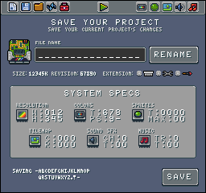

# Tilemap Flags

The `tilemap-flags.png` represents tile collision data. Each tile can be assigned a specific color, and that color corresponds to an ID number flag. The PNG is read in 8x8 pixel chunks, but the first pixel color is used and the others are ignored. When a flag color is detected, the flag’s value is set. Here are the supported flag colors and their corresponding values:

<table>
  <tr>
    <td>Flag 0
#000000</td>
    <td>Flag 1
#101010</td>
    <td>Flag 2
#202020</td>
    <td>Flag 3
#303030</td>
    <td>Flag 4
#404040</td>
    <td>Flag 5
#505050</td>
    <td>Flag 6
#606060</td>
    <td>Flag 7
#707070</td>
  </tr>
  <tr>
    <td>Flag 8
#808080</td>
    <td>Flag 9
#8f8f8f</td>
    <td>Flag 10
#9f9f9f</td>
    <td>Flag 11
#afafaf</td>
    <td>Flag 12
#bfbfbf</td>
    <td>Flag 13
#cfcfcf</td>
    <td>Flag 14
#dfdfdf</td>
    <td>Flag 15
#efefef</td>
  </tr>
</table>

The best way to create a collision mask is to overlay the flag colors on the tile map and export them without the tiles in the background so they match up:

It’s important to note that the `tile-map.png` needs to match the exact dimensions of the `tilemap.png` or they will not work.


