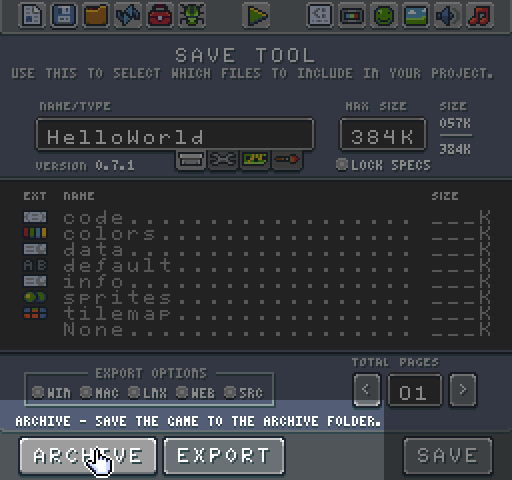
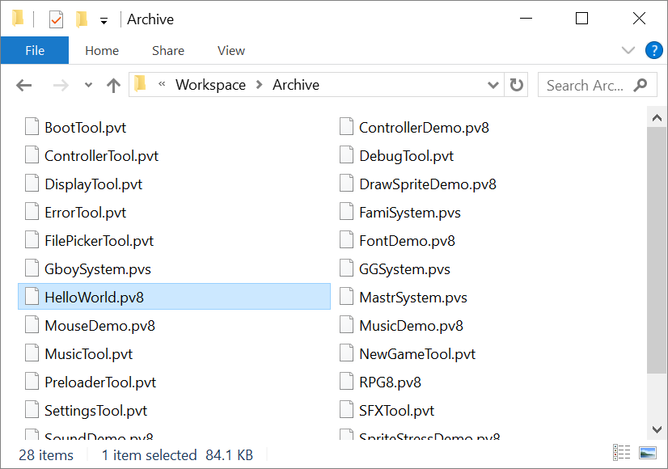
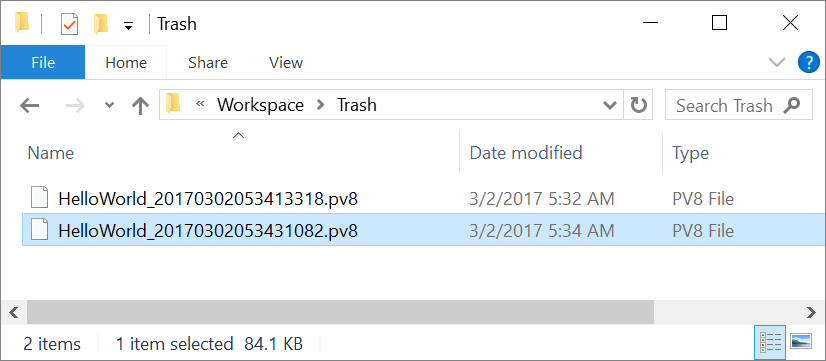
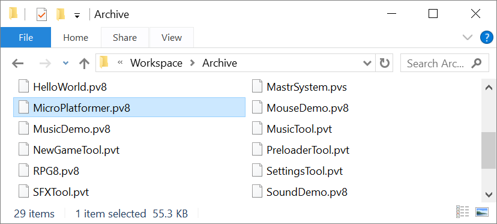
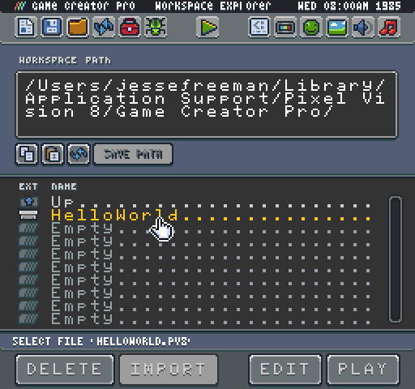
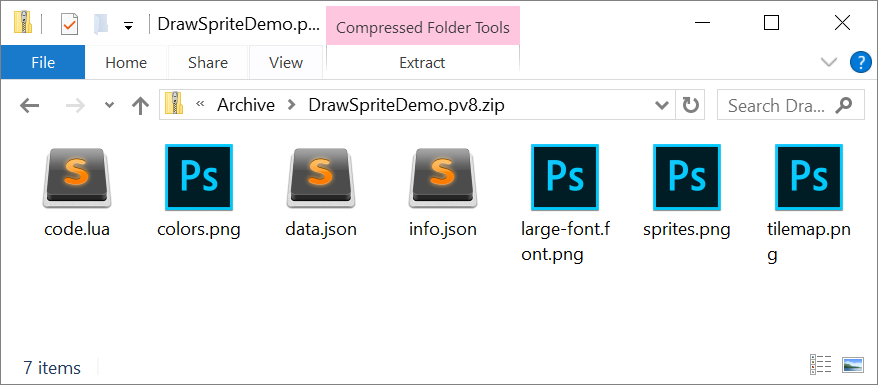
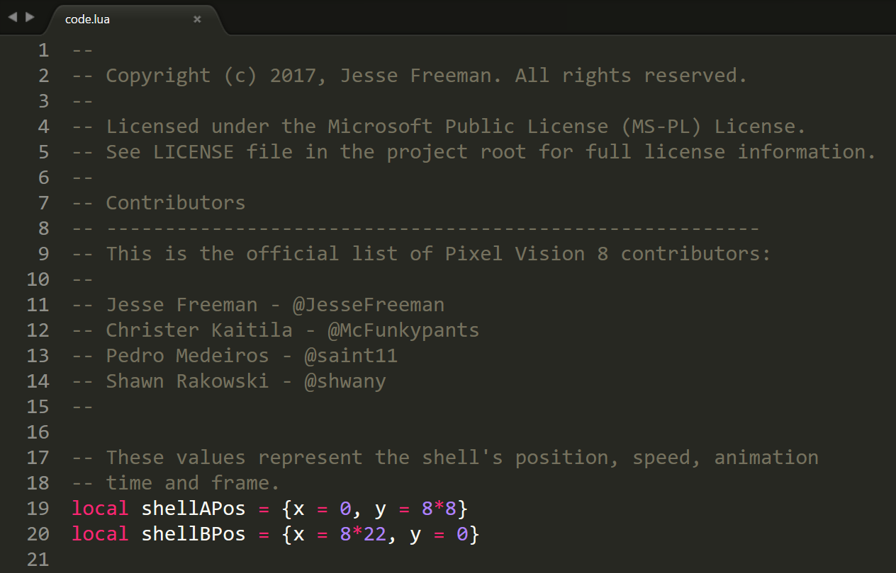

# Working With Archived Games

Pixel Vision 8 was designed to teach people how to create 8-bit games. With that in mind, the Game Creator's file format is not only easy to share with others but also easy to open up and view its contents. Game files, including system templates and tools, are simply .zip files. You can easily open any of the ones included with the Game Creator by changing the extension and unzipping it. Let's look at how we can add new games to Game Creator as well as how to view their contents.

The most common type of file is going to be a .pv8 which are a Pixel Vision 8 game. Pressing the Archive button in the Save Tool converts the contents of the Game directory into a .pv8 by default.

Once the contents of the Game directory are packaged up, it is copied over to the Archive directory. 

If a file with the same name exists, the previous version is moved into the Trash directory and renamed with a timestamp. 

If you download a game from somewhere else, you can simply put it into your Archive directory.

Any supported files added to the Archive folder automatically show up inside of the File Picker Tool.

The Game Creator includes a collection of demo games, tools and more based on the version you own. You are encouraged to look at the included files to learn more about how to structure and organize your projects. To do this, simply go into the Archive folder and find the demo game you want to open. Simply append .zip to the end of the name and unzip it.

If you want to run a game manually, you can always select the contents of a unzipped game and copy them over to your Game directory. 

One thing to keep in mind is that any developer or player can explore the contents of your game as well. Feel free to add a license file to your game letting others know what they can and can't do with the code and artwork.

As you look through some of the files included in the Game Creator, game demos are fully open source while tools simply allow you to modify them but limit sharing publicly with others.


