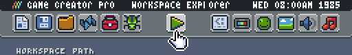
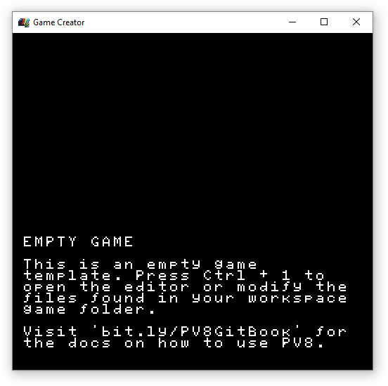
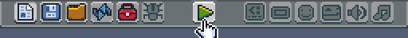
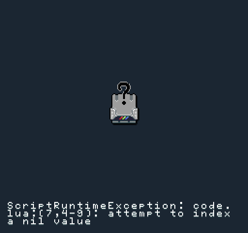
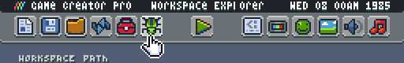
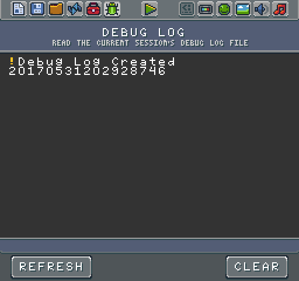
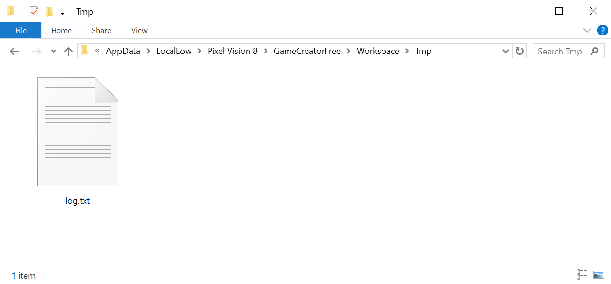

# Editing a Game

When you launch the Game Creator, it automatically launches into the Workspace Explorer Tool.

If a game exists in the Workspace/Sandbox directory you can hit play to load it up.

You can launch any game you are currently editing at any point by pressing the play button or pressing `Ctrl + 1`.

You can exit a game by pressing `Ctrl + 1` or `Esc`. When editing a game, all of the game's files are inside of the Workspace’s Game directory.

Pixel Vision 8 game files can be modified by external editors. This allows you to use Photoshop, Aseprite, or any pixel editor for creating sprites and tilemaps. Likewise, feel free to use any code editor for working with a game's Lua and JSON files. 

At any point, you can switch back into the Game Creator’s edit mode by pressing `Ctrl + 1`. When exiting a game, you will be brought back to the last tool or the Workspace Explorer by default. You can always return to play mode by pressing the play button or using the `Ctrl + 1` keyboard shortcut.

If you are playing a game and want to see any changes you have made externally, you can also use `Ctrl + 4` to force the game to reload without entering edit mode. If your game fails to load, the Game Creator shows an error screen to help you debug the issue.

Once you have fixed the error, simply reload the game. All errors and print statements are visible in the Debugger Tool. You can open this tool by switching to edit mode and selecting it from the toolbar.

The Debugger icon allows you to quickly jump into the Game Creator’s log.txt file. It is loaded up into the system’s Text Editor. 

When you exit the Game Creator, the log file is deleted along with all of the contents of the Tmp directory. You can access the log file directly from Workspace's Tmp folder.

Since it is a text file, you can open it in any external text editor.


