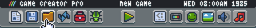
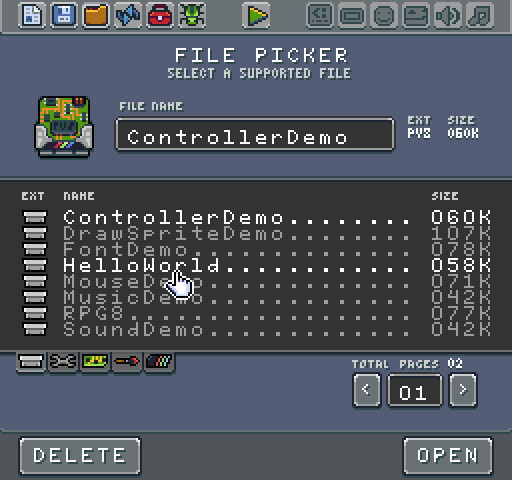
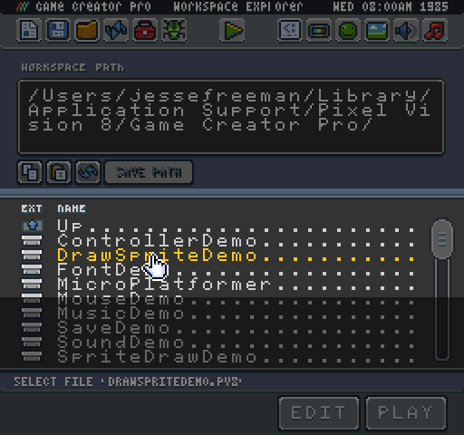
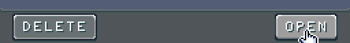
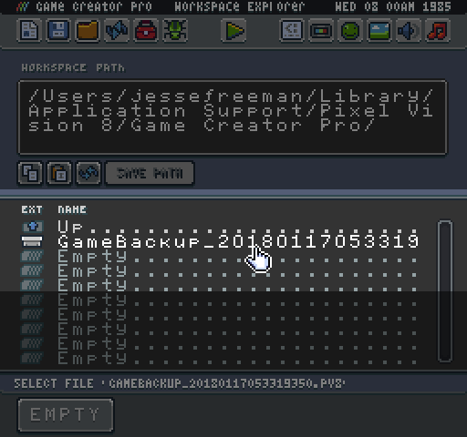

# Loading Games

To load a game, go into edit mode by hitting `Ctrl + 1` and then click on the folder icon in the toolbar.

From here, you will be taken to the Workspace Explorer Tool.

One the Explorer Tool as loaded, you can navigate to the Demos folder to look at the built-in examples that come with the Game Creator. To play a game, double-click on file's name. This will load in preview mode allowing you to test out the game, play it, and see how it runs.

All of the games you create will go into the Workspace/Games folder. You can easily edit a built-in demo or one of your games by selecting it and clicking on the edit button at the bottom of the tool.

The Workspace Explorer Tool replaces the contents of the Sandbox folder when loading a new game. Make sure to save the current game before loading a new one. Whenever you start editing a new game, the contents of the Sandbox are archived and put in the Workspace/Trash folder allowing you to restore a copy of the last project you were working on.

Also, if for some reason a project does not load, you get an error.

You may see permission errors when files in the Game folder are open in an external application. When this happens, it is best to close out of any external editors and manually delete the Game folder.


