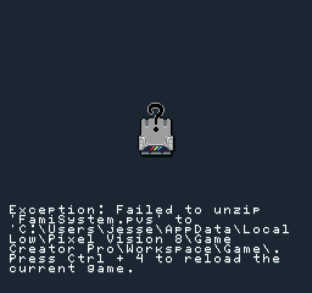

# Loading Games

To load a game, go into edit mode by hitting `Ctrl + 1` and then click on the folder icon in the toolbar.

From here, you can pick the game you want to load. 

The File Picker Tool helps organize all the games in the Workspace's Archive folder. By default, the file picker displays games ending in Pixel Vision 8's `.pv8` extension. You can change the extension filter to show other types of files that the Game Creator supports. 

Once you have found the file, you want to load. Select it and click the open button at the bottom of the tool.

The File Picker Tool replaces the contents of the Game folder loading a new game. Make sure to save the current game before loading a new one. Game Creator does not move files inside of the Game folder to the trash. Also, if for some reason a project does not load, you get an error.

You may need permission errors when files in the Game folder are open in an external application. When this happens, it is best to close out of any external editors and manually delete the Game folder.


