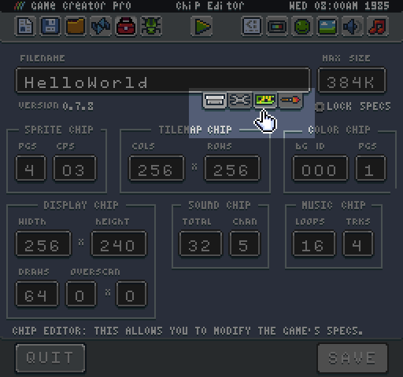

# Project Types

Pixel Vision 8 games are zip files with a custom extension. Each extension type tells the engine how to handle it. The extension simply tells PV8 how to load the file and unzip it. You can change your project type at any time by selecting a file extension in the System Setting Tool.

Here is a breakdown of all the supported extensions and how they work:

<table>
  <tr>
    <td>Type</td>
    <td>Ext.</td>
    <td>Description</td>
  </tr>
  <tr>
    <td>Game</td>
    <td>.pv8</td>
    <td>A game represents all the code, settings and art needed to run. This is considered the final product and is ready to be shared with others.</td>
  </tr>
  <tr>
    <td>Tool</td>
    <td>.pvt</td>
    <td>A tool is a game that runs with specific ties to the editor API. The engine can load a tool alongside to a game allowing you to edit the currently loaded game.</td>
  </tr>
  <tr>
    <td>System Template</td>
    <td>.pvs</td>
    <td>A system template is a base project to start making a game on top of. This could just be the .json system specs, or it could also include code, art, etc. There are five base templates, but you can always create your own. Contents of the template are simply copied to the Game folder in the workspace and are not linked back to the original template to give you a fresh start.</td>
  </tr>
  <tr>
    <td>Asset Pack</td>
    <td>.pva</td>
    <td>When loading an asset pack, the contents of the project are simply copied over into the current Game folder inside the workspace. This allows you to share art resources, sounds, and music between projects.</td>
  </tr>
</table>

All of the above extensions are technically games to PV8. They share the same file structure inside the zip. The extension simply tells PV8 how to load the file and unzip it. 


