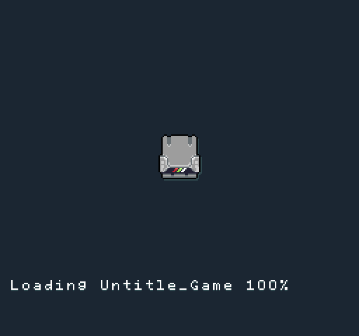

# Making Pixel Vision 8 Games

Pixel Vision 8 games are designed to run with the Pixel Vision SDK. This open source SDK is written in C# but also supports Lua games. While you could easily build PV8 games natively, the Game Creator streamlines this process. It also provides a standard file format, loading mechanism, and asset pipeline.

The Game Creator packages up PV8 games in a zip format. Based on the use, the file has a unique extension. Games are saved as `.pv8` files while tools and system templates end in `.pvt` and `.pvs` respectively. The Game Creator manages setting up new games from scratch as well as archiving them when you are done making changes. These archive files can also be shared and run by other Game Creator users.

Understanding how the Game Creator manages games inside of the Workspace is essential to making your Pixel Vision 8 games that others can play.

 


