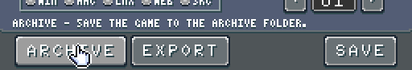
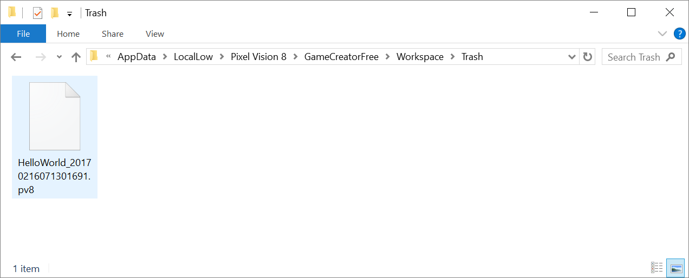

# Saving Games

When you are working on a project in the Workspace’s Game directory, the save icon in the top menu becomes active. This button opens the Game Creator's Save Tool.

From within the Save Tool, you can rename your game, change its project type, see the contents of the Game directory, as well as archive and export it. *This tool is still under development and may have missing features or contain bugs. Please report any issues on the **[forum*s](https://pixelvision8.itch.io/game-creator/community)*.*

Before saving a game, you should rename it. The Save Tool allows you to rename game projects without having to modify the info.json file manually.

Here you can modify the game's name, its type as well as the maximum size for the game to be. 8-bit games had specific limitations around how big they could be. This value is initially set by the system template you chose, but you can also increase or decrease this value based on your needs.

Whenever you make changes to your project's settings you should hit the save button at the bottom of the tool. 

This does not save the game but instead writes the changes to the game's data file. In the case of renaming a game, the data is writing into the info.json. To add the game to the Game Creator’s collection, click on the Archive button at the bottom of the screen.

This action copies your project over to the Archive folder. An archive contains the zipped contents of a game. The Game Creator uses the name of the game for the archive, and the .zip extension is modified based on the game's type. 

This means that you can unzip any game in the Archive folder manually by changing the extension back to .zip and extracting the contents. Feel free to go through any of the included tools, demos or system template files to see how they work. Archiving the file is also useful for sharing with others. You can install new games by adding them to your Archive folder.

If there is an existing game with the same name in the Archive folder, it is time stamped and moved into the Trash folder.

The Trash folder is emptied automatically whenever you shut down the Game Creator. You can stop the Game Creator from deleting trash in the Settings Tool.

You can continue to work on your game even after you archive it. Just remember to save any changes and re-archive it before moving into the next project or you may lose all of your changes.


