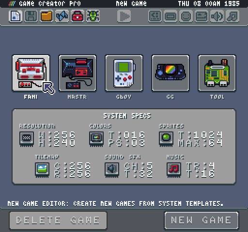
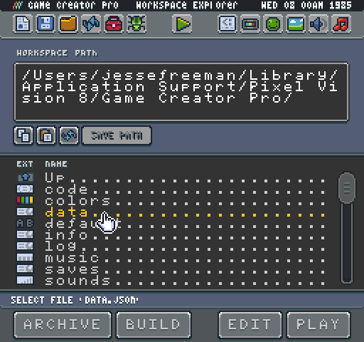
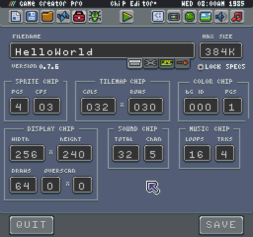

# System Templates

Under the hood, the Pixel Vision 8 engine is broken down into several "chips" that control how the engine behaves. The chip system is modular, allowing you to define each chip’s limitations. When creating a new game, you can customize system limitations by selecting one of the pre-configured system templates:

The specs panel represents a summary of a system template’s limitations. It is broken down into six aspects that map over to Pixel Vision 8’s built-in chips. Here are the main chips groups that make up a working system: resolution, colors, sprites, tilemap, sound SFX, and music. Together these limitations help define what you can and can’t do when making PV8 games and tools.

Here is a breakdown of each property: 

### Resolution

<table>
  <tr>
    <td>W</td>
    <td>Width</td>
    <td>The width of the screen’s resolution.</td>
  </tr>
  <tr>
    <td>H</td>
    <td>Height</td>
    <td>The height of the screen’s resolution.</td>
  </tr>
</table>

### Colors

<table>
  <tr>
    <td>T</td>
    <td>Total</td>
    <td>Total number of colors the system supports.</td>
  </tr>
  <tr>
    <td>PS</td>
    <td>Colors Per Sprite</td>
    <td>Total colors per sprite.</td>
  </tr>
</table>

### Sprites

<table>
  <tr>
    <td>T</td>
    <td>Total Sprites</td>
    <td>The total number of sprites allowed in the memory.</td>
  </tr>
  <tr>
    <td>Max</td>
    <td>Maximum Sprites</td>
    <td>The maximum number of sprites the display can render in a single frame.</td>
  </tr>
</table>

### Tilemap

<table>
  <tr>
    <td>W</td>
    <td>Width</td>
    <td>The width (in tiles) of the tile map.</td>
  </tr>
  <tr>
    <td>H</td>
    <td>Height</td>
    <td>The height (in tiles) of the tile map.</td>
  </tr>
</table>

### Sound

<table>
  <tr>
    <td>CH</td>
    <td>Channels</td>
    <td>The total number of channels on which the system can play sounds.</td>
  </tr>
  <tr>
    <td>T</td>
    <td>Total</td>
    <td>The total number of sound effects the system can store in its memory.</td>
  </tr>
</table>

### Music

<table>
  <tr>
    <td>TR</td>
    <td>Tracks</td>
    <td>The total number of tracks the music chip can use to play back sounds.</td>
  </tr>
  <tr>
    <td>T</td>
    <td>Total</td>
    <td>The total amount of music data the system can store in its memory.</td>
  </tr>
</table>

After you’re game is created, you can open up the Chip Editor to make more granular changes. Simply navigate to the Workspace/Sandbox folder in the Workspace Explorer Tool and double click on the data.json file.

Once opened you’ll have access to all of the high level chip values allowing you to customize things to your liking.

Once you are done changing the chip values, don’t forget to hit save to write the changes back to the data.json file.


