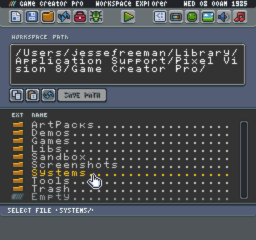
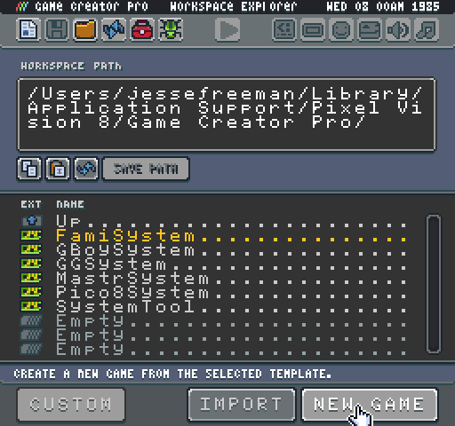
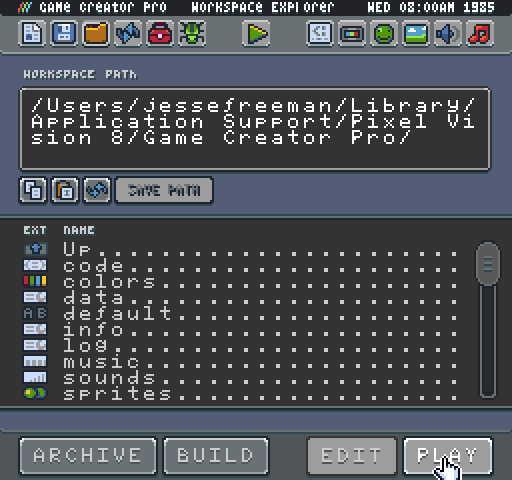

# Creating A New Game

When you load up Game Creator for the first time, you are taken directly to the New Game Tool.  

You can create an empty game project by clicking on the new game button at the bottom of the screen. 

Once pressed, the Game Creator copies the default system template over to the Game folder. When the Game folder is ready, Game Creator automatically switches back over to play mode presenting you with a new game file and some instructions on how to edit it.

At this point, you are ready to start coding your game. If for some reason there was a problem loading a game, the Game Creator shows an error with instructions on what to do to fix the problem. 

You can always switch back to edit mode by pressing `Ctrl + 1`. By default, the New Project Tool should automatically load.

Before you create a new game, you must decide which system template you want to use.

.


