# Working with External Editors

The Game Creator was designed to operate in conjunction with your favorite external graphic and code editors. While there are tools built into the Game Creator, they were primarily designed to help debug and configure the engine, not create new content. With that in mind, the Game Creator is flexible enough to adapt its workflow to how you like to work. To get started, let’s talk a little more about the Workspace and the Game folder.

When you boot up the Game Creator, it automatically creates a workspace for you. This location is based on which OS you are running it on. You can see the Workspace’s path by going into the settings tool.

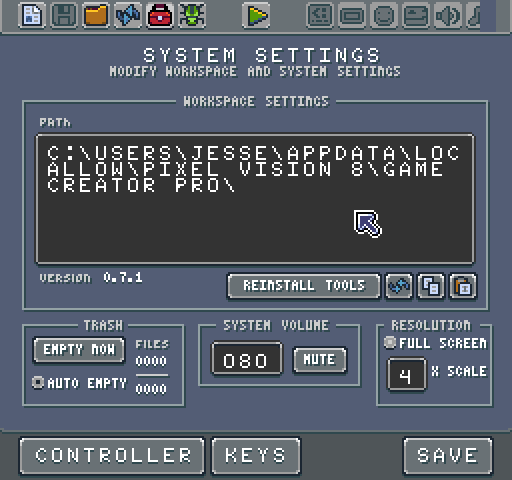

From inside the Settings Tool, you can get the path by clicking on the Copy button below the path window.

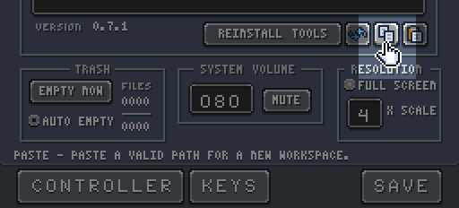

Once you have the path in the clipboard, just navigate to it on your computer, and you will have access to the Workspace on the filesystem.

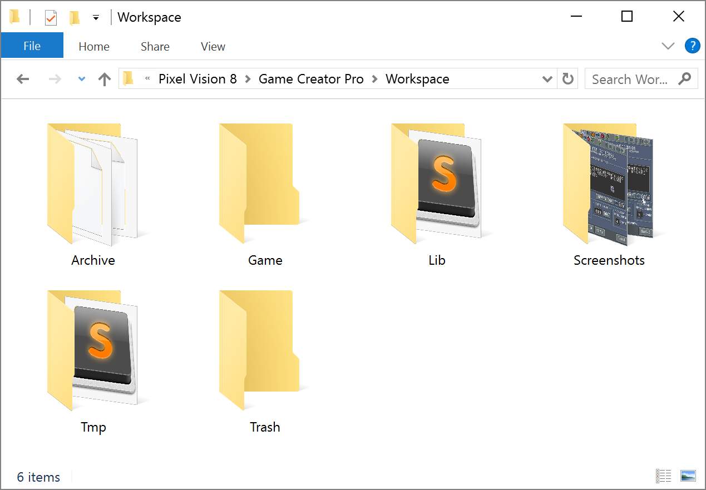

You can learn more about how this folder works by reading the Workspace section of this book. Right now we are just going to focus on the Game folder. When you begine editing a game, its contents are added to this folder making it easier for you work with. As an example, let’s open up the Tilemap Demo.

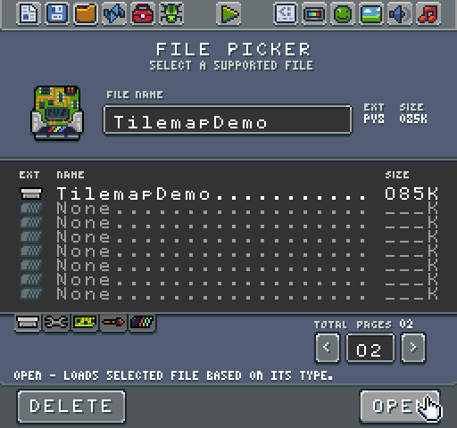

Once opened, you will see the following game running.

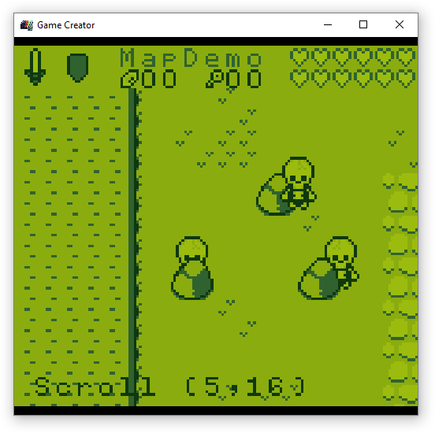

Now if we look in the Workspace’s Game folder, we have access to all of the files that make up the game.

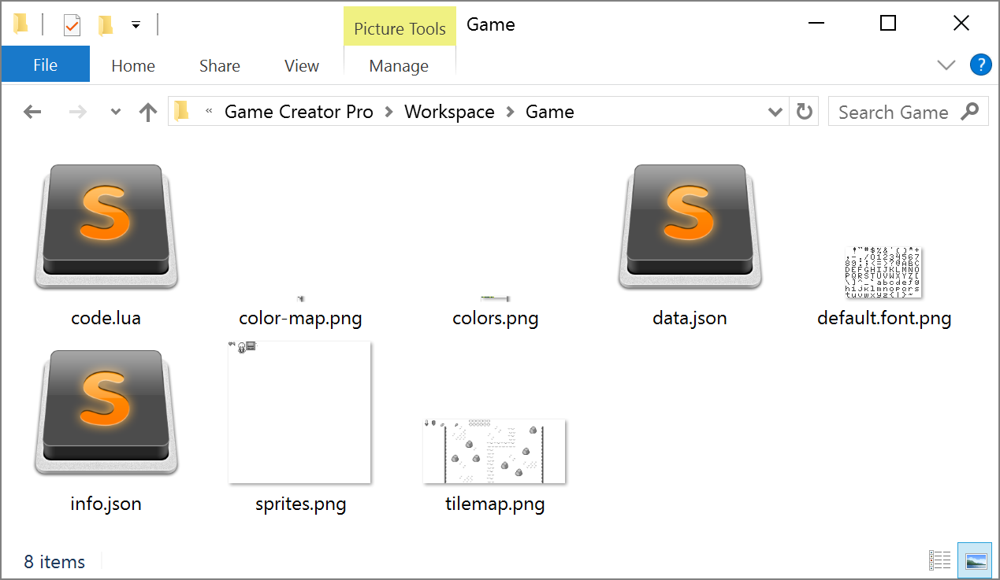

A normal Pixel Vision 8 game is comprised of two types of files, text, and png. The `code.lua`, `data.json` and `info.json` files are all text based and are editable in any flat text file editor you like such as Sublime Text, Notepad ++ or even Visual Studio Code. You can also load these .png images in Photoshop, Gimp, Aseprite or MS Paint if you wanted to. While the pro version the Game Creator includes tools for working with these files, each of them can be modified by hand and then reloaded at runtime to see the results.

To get started, let’s go ahead and change the resolution. Simply open up the `data.json` file and look for the `DisplayChip`. If you are using Sublime Text, you can open up the entire Game folder as a project.

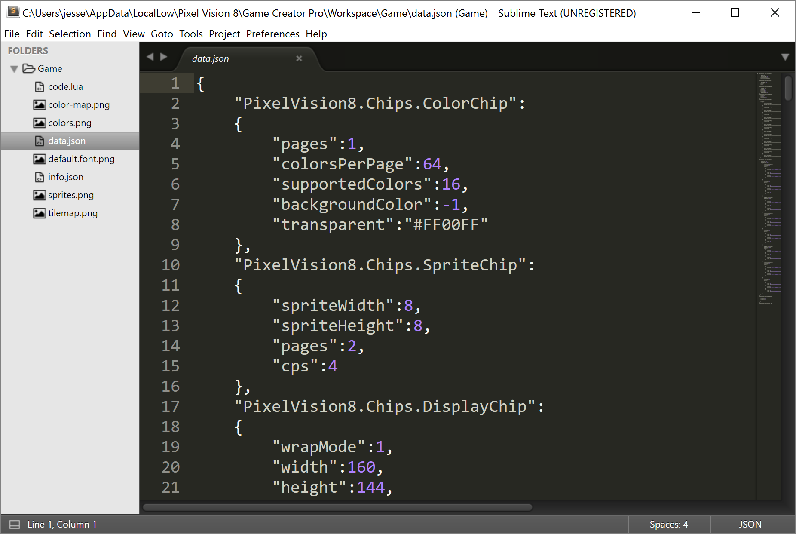

You will see in the Display Chip that we can change the width and height by simply setting a new value. Let’s change it to a higher resolution like `256` x `240` which was the Nintendo’s native resolution.

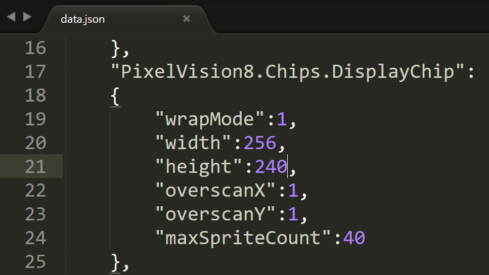

Once you have saved the file, go back into the Game Creator and hit `Ctrl + 4` to reload the game.

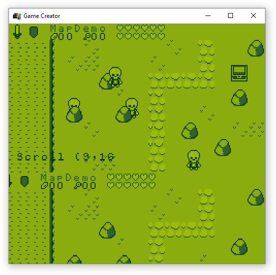

As you can see, our game is now running at a higher resolution, but the tilemap was not designed for this. While the tilemap does fill the screen, if you look closely you will see that it is actually repeating itself. We can quickly fix the tilemap by opening it up and making it larger. Open up the tilemap.png and resize the canvas to be `240` pixels high.

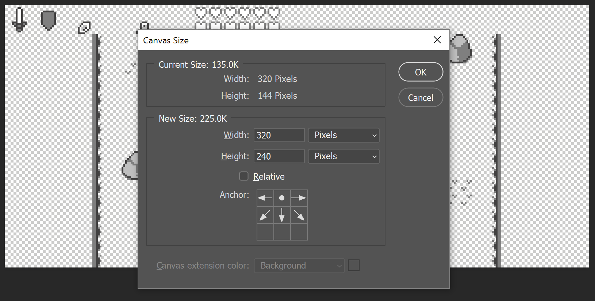

Then just copy the contents of the tilemap, except the HUD area, to the new area in the image.

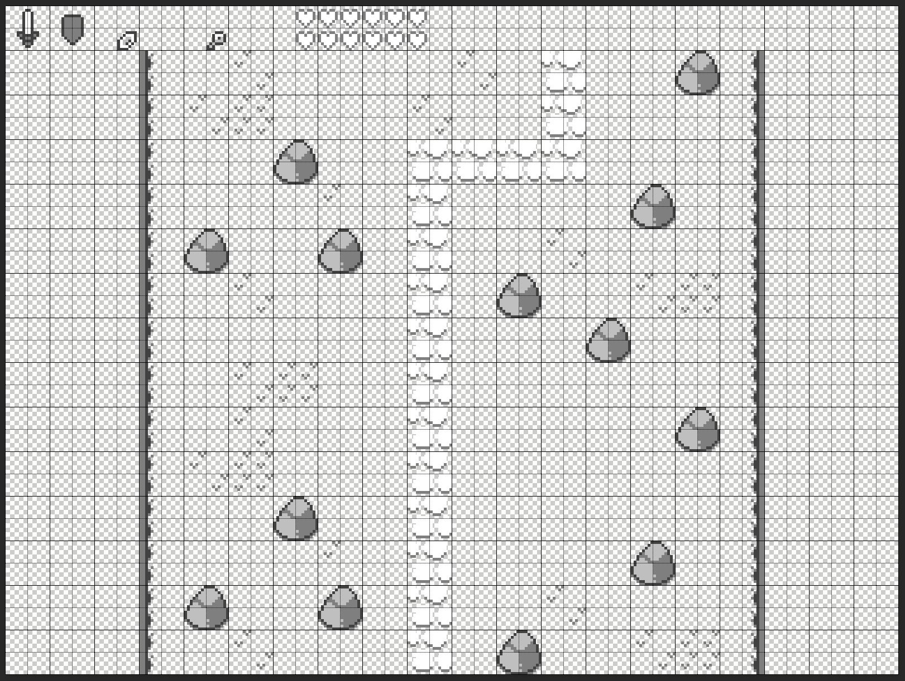

As you can see in my tilemap image, I made the path extend down to the bottom of the screen. Go back into the Game Creator and reload the game.

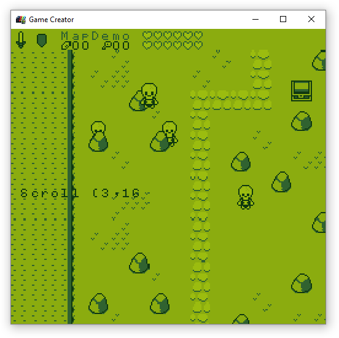

As you can see, our tilemap is now filling up the entire screen correctly. The last thing we should do is move the scroll position text down to the bottom of the screen. Go back into your text editor and open up the code.lua file. Look for the line in the Draw method where we display the scrolling text and change the `Y` position to `220`.

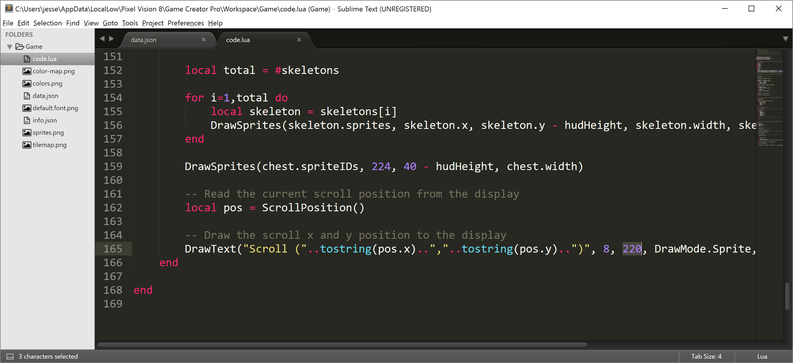

Now if you reload your game, the text should be rendered in the correct place.

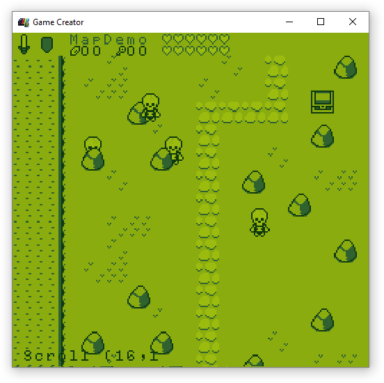

At this point, you should have a basic idea for how to use your favorite text and image editors to make Pixel Vision 8 games in the Game Creator. As you get more comfortable working with files in the Game folder you can leverage more advanced workflows such as using [Tiled](http://www.mapeditor.org/), which is a free tilemap editor, to load in your sprites.png, lay out your tilemap, then export it as a PNG. Likewise, you can use Photoshop automation to create sprite sheets out of single sprite files or generate out individual sprites from design to use with the Sprite Builder.


