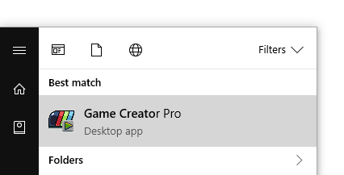
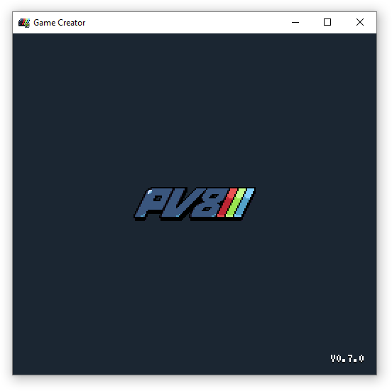
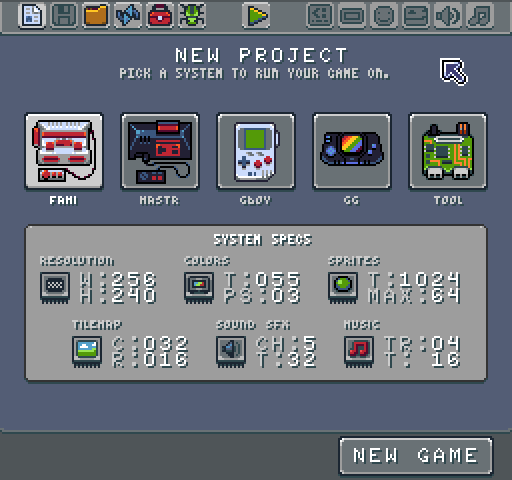

# Launching the Game Creator

Pixel Vision 8: Game Creator works on Mac, PC and Linux. Simply run the installer or the executable directly to open the development environment.

If you are running the Game Creator on Linux for the first time, you may get the following error:

Simply right click on the version for your system, and set its permissions to run as an executable like so:

.

By default, Pixel Vision 8 runs in window mode. You can resize the window to fit your needs. A full-screen toggle is planned for a future release. 

Once the Game Creator is launched, it will boot and attempt to run a game if one exists. If no game is present, Game Creator will boot up the editing environment.

If you decide to leave the editing environment when no game is present, you’ll see an error screen.

Next, we will learn about the workspace as well as how to load games and tools.


