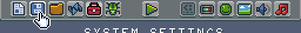
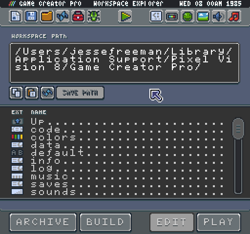
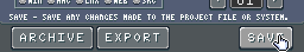
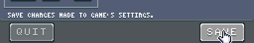
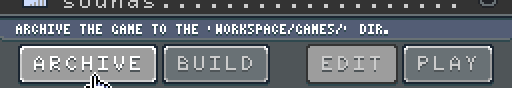
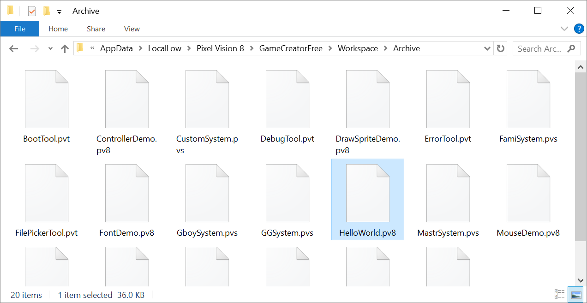
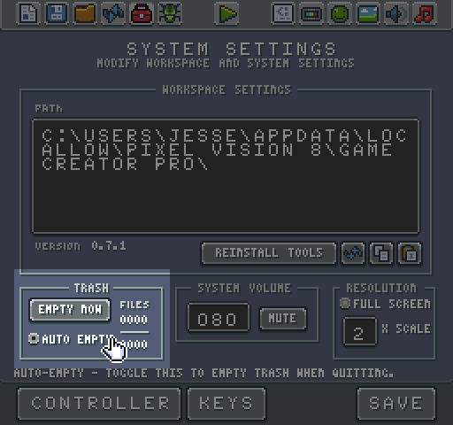

# Saving Games

When you are working on a project in the Workspace’s Game directory, the save icon in the top menu becomes active. This button navigates to the Workspace Explorer Tool’s Workspace/Sandbox directory.

From within the Sandbox directory, you can see the contents of the Game directory, as well as archive and export it. 

Before saving a game, you should rename it. To do this, you’ll need to open up the Chip Editor which allows you to modify your games name, file type and specs. The Chip Editor is automatically launched when you double click on the data file in the game’s project.

Here you can modify the game's name, its type as well as the maximum size for the game to be. 8-bit games had specific limitations around how big they could be. This value is initially set by the system template you chose, but you can also increase or decrease this value based on your needs.

Whenever you make changes to your project's settings you should hit the save button at the bottom of the Chip Editor Tool. 

This does not save the game but instead writes the changes to the game's data file. If you make any changes to a game’s settings and do not hit save, you could lose those modifications when quitting the tool. Once you are done renaming your game, quit the Chip Editor and you’ll be taken back to the root of the game’s directory in the Workspace Explorer Tool. To add the game to the Game Creator’s collection, click on the Archive button at the bottom of the screen.

This action copies your project over to the Archive folder with is in the Workspace/Games directory. An archive contains the zipped contents of a game. The Game Creator uses the name of the game for the archive, and the .zip extension is modified based on the game's type. 

This means that you can unzip any game in the Archive folder manually by changing the extension back to .zip and extracting the contents. Feel free to go through any of the included tools, demos or system template files to see how they work. Archiving the file is also useful for sharing with others. You can install new games by adding them to your Archive folder.

If there is an existing game with the same name in the Archive folder, it is time stamped and moved into the Trash folder.

You can continue to work on your game even after you archive it. Just remember to save any changes and re-archive it before moving into the next project or you may lose all of your changes.


