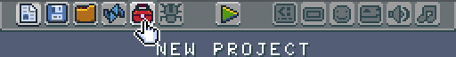
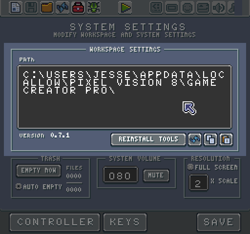
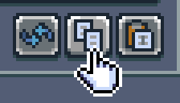

# The Workspace

The Game Creator makes a Workspace folder in a shared location on your computer. By opening up the Workspace folder, you can work directly on a game’s files in your editor of choice. To get the path, you can to enter editor mode by pressing control 1 on the keyboard. Once in edit mode, you can access the workspace explorer tool from the top navigation.

Once you load up the workspace explorer tool, you should see a screen like this that shows you the path to where the workspace folder exists on your computer.

You can change this path to anywhere on your computer. 

There are buttons to reset the path, copy the existing path or paste in a new path. To navigate to the default location, select the copy button and paste the path it into the file browser on your computer. 

Inside the Workspace folder are four directories: `Games`, `Sandbox`, `Lib`, and `Trash`.

The `Games` folder is where the Game Creator stores finished games, tools, and systems. The `Sandbox` folder is for any game the engine is currently running, or you are editing. This directory is persistent and only replaced when you load a new game. Since this folder is persistent, you to continue working on a game across different sessions. The `Lib` folder contains Lua scripts shared across different games or tools. `Trash` contains files that ready to be deleted.

You can override the default system path by pasting in the path where you want to store your workspace on your computer. Game Creator confirms that the path is valid before creating the new Workspace folder along with all the required projects. Contents inside of the `Games`, `Sandbox`, `Lib` or `Trash` folder are not copied over when creating a new workspace.


