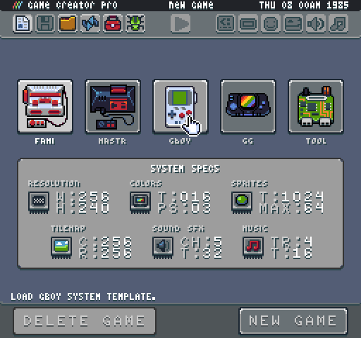

# About The Game Creator Documentation

### This documentation is currently a work in progress. Parts of it may be incomplete or missing. Make sure to continue to check for updates as each version of the Game Creator is released.

The [Game Creator](https://pixelvision8.itch.io/game-creator) is a full development environment for authoring 8-bit games and is built on top of the open source [Pixel Vision SDK](http://pixelvisionsdk.com) framework. 

It contains project management, asset creation, and coding/debugging tools. This all in one solution enables complete end to end development allowing anyone to create desktop games, share them and even build custom tools.

This documentation is designed to cover how to work with the Game Creator. It explores everything you need to know about installing the Game Creator, making games and how the tools work. You should check out the quick start guide before reading more of the in-depth material covered in this documentation. Once you have read this documentation, you will be ready to not only make Pixel Vision 8 games but also understand how to optimize them and extend the editor by with custom built tools.

**Latest version** - v0.7.2 available at [http://pixelvision8.com](http://pixelvision8.com)


