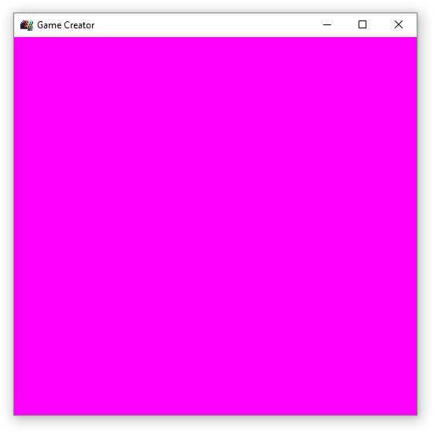
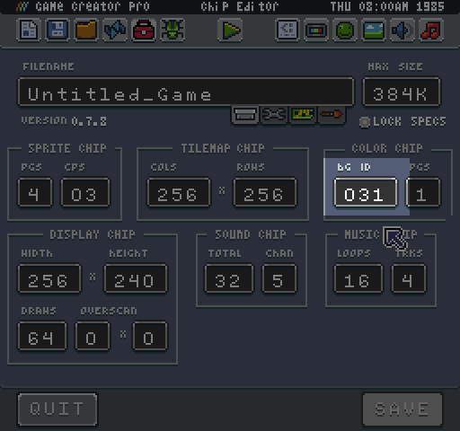
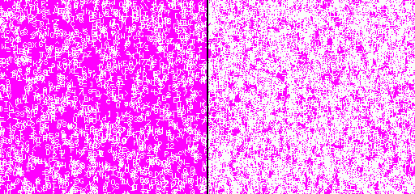

# Clearing The Display

When you create a new project without any code in it, the display simply shows the background color. This default color is magenta (#FF00FF). This color is displayed whenever a color value is out of range.

Since the background color is set to -1 by default, you are not able to display much else. You can always override the default background color in the Tilemap Tool.

Now if you refresh the game, you can see the new color. However, it is important to note that the display is not rendering anything new. You have to tell the renderer it needs to display pixel data. The easiest way to do this is by calling `Clear()`.

Not only does this method display the current background color, it also removed the previous frame's pixel data. If you were to render a sprite to the display and move it without calling clear, it would ghost.

You can update the background color at any time, and the next time the engine calls Clear(),  the color reflects the change. Try adding this to your `Update()` method:

`BackgroundColor(math.random(0, 3))`

Now when you refresh your game, the background will randomly change between the first 3 colors. Understanding how to correctly clear the display is critical to creating clean render logic for your game.


