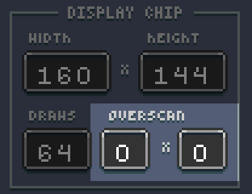
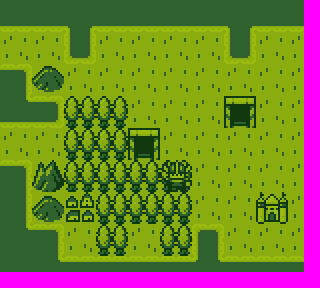
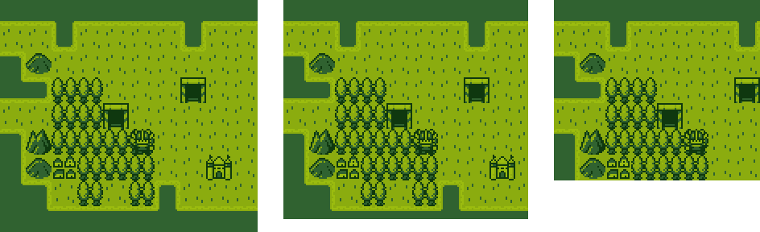
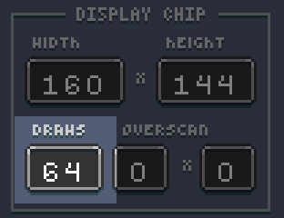
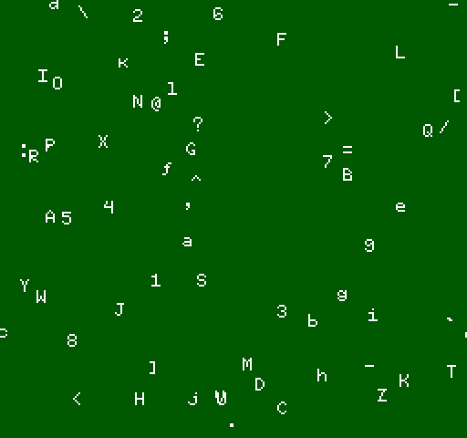
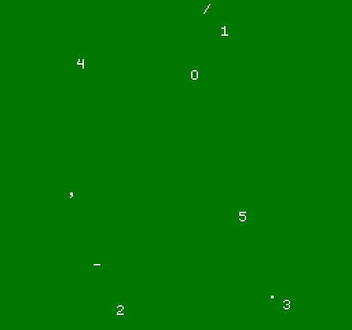

# Configuring the Display

Now that we have talked about setting up the system colors, it is time to look at the display panel options.

The display panel is broken up into 3 main groups. The first handles the width and height of the screen. By default, Pixel Vision 8’s native resolution is 256 x 240. While you are not limited to this resolution, all games are scaled to fit inside of it. That means if you change the resolution to 160 x 144, which is the resolution of the GBoy template, black bars appear at the top and bottom of your game.

The maximum resolution you can set a game to is 320x 240. It is important to note that while in windowed mode, games larger than 256 x 240 pixels are scaled down. In full-screen mode, games are displayed at their native resolution or as close as the engine can scale them to.

It is also important to note that resolutions higher than 256 x 240 may incur a performance penalty. At its default resolution, Pixel Vision 8 must display 61,440 pixels per frame. Larger resolutions increase this number exponentially and drastically slow down FPS. If you are having issues with a game running on lower powered systems, it is best to use a smaller resolution. Rendering fewer pixels means better performance.

Overscan allows you to simulate how 8-bit game systems handled rendering issues CRT monitors have around the edges of the display. The overscan fields tell the engine how many pixels to crop the right and bottom side of the screen. Leveraging Pixel Vision 8's overscan area is useful when trying to hide sprites off screen to keep them from wrapping. Older consoles had the ability to blank, or not render, a row or column of the display to account for this.

The game creator allows you to modify the overscan value directly. The first value represents the right border of the screen and the second represents the bottom. Each value removes 8 pixels which is a single row or column from the tilemap. 

Let's look at a demo running at the GBoy resolution of 160 x 144 with overscan set to 0. If we change the overscan to 1 x 1, the far right column and bottom row are not rendered. 

Changing the overscan makes the resolution 152 x 136 since the Game Creator automatically scales the game to hide the overscan area. On its own, overscan cropping is hard to see. To help illustrate it, here are the 3 different overscan values next to each other.

On the left we have an overscan of 0 x 0 at a resolution of 160 x 144, in the middle overscan is set to 1 x 1 and on the right, the overscan is 4 x 4, the maximum value, which makes the visible resolution 128 x 112. To learn more about how overscan works and when to use it, check out the dedicated chapter in this book.

 

There is one field left to talk about, Draws. This field configures the maximum number of sprites the game can render at any given time. 

Original 8-bit consoles had hard limits on the number of sprites they could display during a single frame. Each one of the Game Creator templates has its value. By default, Pixel Vision 8 is 64. You can see how changing this value works by loading up the Sprite Stress Test Demo. Here you can see a screenshot of this demo attempting to render 64 sprites to the display in each frame.

If you change the value to 10, it automatically caps the sprites drawn to the screen even though the DrawSprite() method is being called 200 times per frame.

The total number of draw calls allows you to not only create more authentic-looking 8-bit games, but it also limits the amount of pixel data pushed to the renderer in each pass. The maximum you can set this value to in the Game Creator is 96. All of the Game Creator tools run at this setting.


