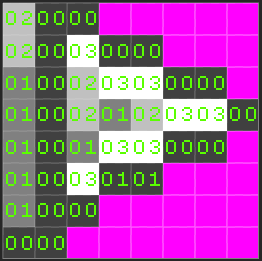

# Rendering To The Display

Pixel Vision 8 is designed specifically to render pixel data to the screen. The way that the Display Chip does this differs greatly from modern rendering techniques. It is the job of Pixel Vision 8's importers to convert sprite's color data into color index values. Each color ID references a color in the Color Chip's memory. 

By converting pixel data into colors IDs, Pixel Vision 8 can optimize storing graphic data in memory. This technique was popular for 8-bit consoles with limited resources. Another advantage of storing pixel data like this is being able to dynamically replace the color of a given ID at run-time letting developers recolor sprites at run-time. It is the job of the Display Chip for making this possible. 


