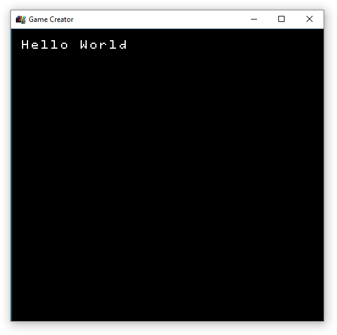
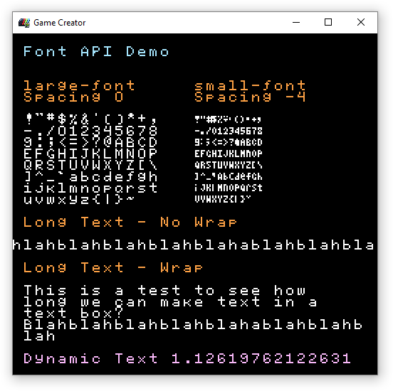

# Rendering Fonts

Drawing fonts to the display works in a similarly to sprites. In fact, fonts are simply sprites whose character ASCII values are mapped over to sprite IDs. When you call `DrawText()` and pass in text, the Font Chip converts each character to a sprite ID and draws it to the display. You can reference a font by its name, which is set during the font import step as a game loads up. Let’s look at a simple font draw call:

`DrawText("Hello World", 0, 0, DrawMode.Sprite, "large-font", 0)`

Here you can see the `DrawText()` method accepts a the text to display, an x and y position, a draw mode, as well as the font’s name and finally a color offset value. The following will display this:

When using `DrawMode.Sprite`, each character is comprised of individual sprites, each character will count against the total number of sprites allowed on the screen at one time. Dynamic fonts are very expensive because of this and should be used sparingly when possible. Ideally, fonts and text should be displayed in the tilemap whenever possible. You can do this by changing the draw mode to `Tile `or `TilemapCache`.

You can also change the letter spacing of text and set a wrap flag. These two optional arguments go after the color offset. You can see an example of all of the different font drawing modes inside of the Font Demo:


