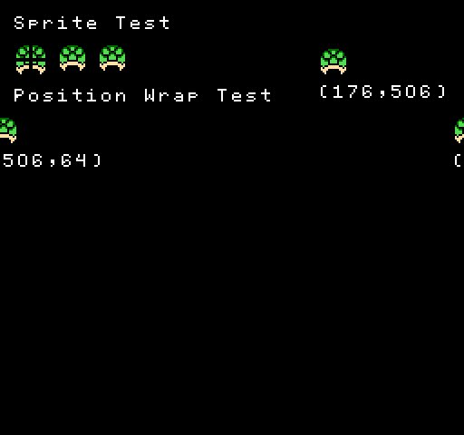
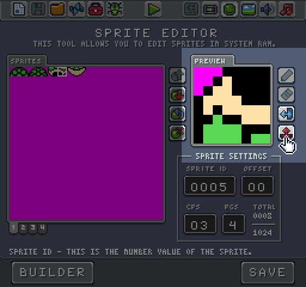
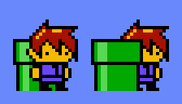
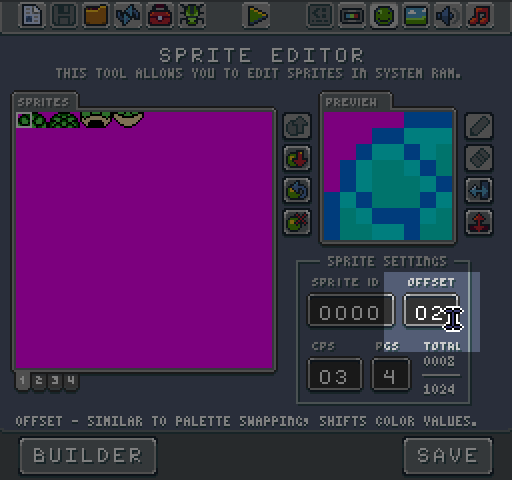
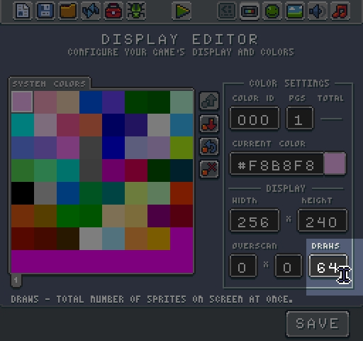
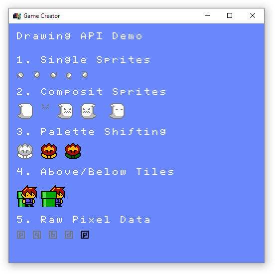

# Rendering Sprites

Once you have defined the background color, you can draw sprites to the display via the `DrawSprite()` method. This method needs to know the sprite ID. Then it requires an x and y position for where to place the sprite on the screen. By default, the display wraps sprite so if you draw a sprite to an `x` or `y` position past the display’s dimensions it appears on the opposite site of the screen. 

When rendering a sprite to the display, there are several optional boolean values you can supply for flipping the sprite horizontally or vertically. You can preview how these affect your sprites in the Sprite Tool.

Next, you can define if the sprite appears above or below the background layer. 

Finally, you can change the sprite’s color offset. The color offset is a value used to shift the each color index inside of the sprite. This offset allows you to emulate palette swapping by increasing or decreasing the color values when drawing a sprite to the display. Color offset can be previewed in the Sprite Tool.

It is important to note that sprite draw calls only happen once per frame. If you want a sprite to remain on the screen, you need to keep calling the `DrawSprite()` method inside of `Draw()`. Likewise, the Display Chip has limitations on how many sprite draw calls it can render per frame. 

By default, the maximums allowed sprites at once is 64. After drawing a frame, the sprite limit is reset and starts back at zero. You can modify this value in the Display Tool.

In addition to drawing one sprite at a time, you can also draw multiple sprites to the screen in a grid to help with rendering larger items. Simply use the `DrawSprites()` method. This method accepts an array of sprite IDs along with a width to render it correctly to the display. You can see full examples of how to draw sprites to the display in the Draw Sprite Demo:


