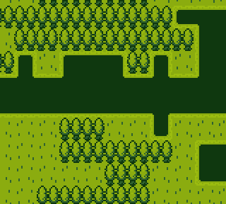
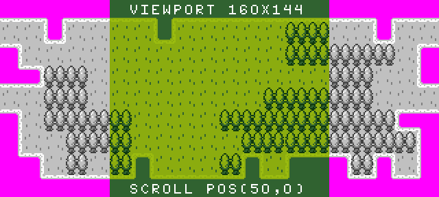
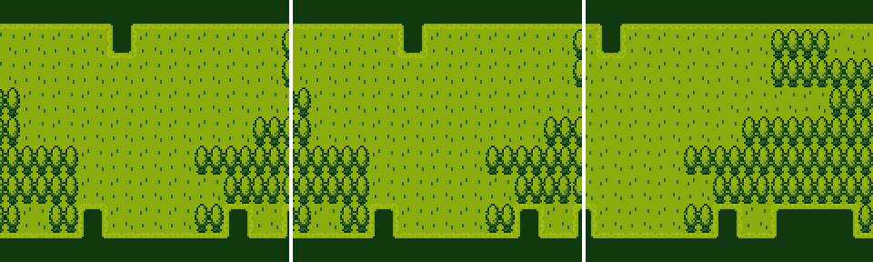

# Rendering The Tilemap

Under the hood, the Tilemap Chip caches sprite bitmap data at run-time to speed up rendering it to the display. This allows you to create an area of pixel data larger than the current display’s resolution and sample only data you can see. This is done by modifying the scroll x and y position. When used in conjunction with `DrawTilemap()`, you can create a large map image in memory and only display what fits on the screen.

If you are manually calling `DrawTilemap(), `you will also need to call the `Clear()` method before it to repaint the display with the background color. You can use the `RedrawDisplay()` method to automatically call `Clear()` and `DrawTilemap()` in one call to keep your code a little cleaner. If there are transparent color references in the tiles, they are filled in with the background color. Here is an example of a tilemap being drawn to the display using `RedrawDisplay()`.

As you can see, the contents of the screen buffer are wrapping. If you sample a region that is larger than the buffer’s dimensions, it samples additional pixels to fill the viewport.

The Tilemap Chip allows you to cache an entire tilemap into memory and helps optimize rendering larger tilemaps. This is also useful for tilemaps where tiles do not need to change or need to be constantly updated. The advantage here is that only the data visible to the screen is copied over to the display when calling `DrawTilemap()`. Here is an example of how this works.

You can pass in `x`, `y`, `width`, and `height `values into the `DrawTilemap()` method in order to control what pixel data the buffer samples and how it is displayed. Modifying the visible tilemap's dimensions allow you to emulate older 8-bit system’s rendering tricks such as splitting the screen to render moving objects below a static navbar. You can also move the tilemap’s scroll value via the dedicated `ScrollPosition()` method which requires an `x` and `y` value. Changing the scroll value allows you to move the background which is a technique seen in side scrolling games.

When rendering sprites to the display, by default, they appear above the tilemap. By changing the sprite’s layer order, you can change this to render the sprite behind the screen buffer.


