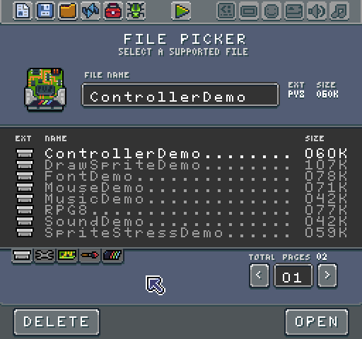

# Demo Games

The Game Creator ships with several demos to help illustrate how to use Pixel Vision 8's APIs. These demos can be found in the File Picker tool. 

The demos focus on specific aspects of the engine from rendering to handling input and more. Each demo is open source allowing you to look at source files as well as use the code in your projects. Here are some of the included demos:

* **Draw Sprite Demo** - Leverages the drawing API to display sprites on the screen. 

* **Font Demo** - Illustrates how to render text to the display.

* **Mouse Demo** - Shows off how to capture mouse input and display a cursor on the screen.

* **Sprite Stress Test Demo** - Highlights the sprite rendering limitation of Pixel Vision 8.

* **Tilemap Demo** - This demo shows off how to load, display and scroll tilemaps.


