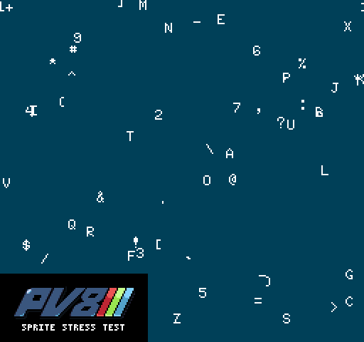

# Lua Script Sample

The Sprite Stress Test Demo highlights the sprite rendering limitation of Pixel Vision 8.

By default, the DisplayChip can only handle displaying a set number of sprites at the same time based on the system template you choose. We'll create a loop that attempts to render more sprites than the system can handle. The outcome is that additional draw calls are ignored and the engine maintains its optimal performance.

Here is the full Lua script:

	local delay = 0
	local delayTime = 2
	local totalSprites = 200
	local x = 0
	local y = 0
	local width = 0
	local height = 0
	local totalColors = 0

	function Init()
		local displaySize = DisplaySize()
		width = displaySize.x
		height = displaySize.y
		totalColors = TotalColors()
	end

	function Update(timeDelta)
		delay = delay + timeDelta
		if(delay > delayTime) then
			BackgroundColor(math.random(0, totalColors))
			delay = 0
		end
	end

	function Draw()
		Clear()
		for i=0,totalSprites,1 do
			x = math.random(0, width)
			y = math.random(0, height)
			DrawSprite( i + 12, x, y, false, false, true, 0)
		end
	end

Let’s walk through the code to see how it uses Pixel Vision 8’s sprite drawing APIs. These are some fields we'll use for performing the stress test.

	local delay = 0
	local delayTime = 2
	local totalSprites = 200
	local x = 0
	local y = 0
	local width = 0
	local height = 0
	local totalColors = 0

The Init() method is part of the game's lifecycle and called a game starts. We are going to use this method to configure background color and get a reference to the display’s dimensions.

	function Init()

It's best to define these outside of the for loop since we only need to set the value once.

	local displaySize = DisplaySize()
	width = displaySize.x
	height = displaySize.y
	totalColors = TotalColors()

Now we just need to end the Init function.

	end

The Update() method is part of the game's life cycle. The engine calls Update() on every frame before the Draw() method. It accepts one argument, timeDelta, which is the difference in milliseconds since the last frame. We are going to use this timeDelta value to keep track of the time before changing the background color.

	function Update(timeDelta)

We start by adding the time delta to the delay.

	delay = delay + timeDelta

Next, we will need to test if the delay value is greater than the delayTime field we set up at the beginning of our class.

	if(delay > delayTime) then

After the appropriate delay, we can change the background color a random value. We'll cap this between 0 and 63.

	BackgroundColor(math.random(0, totalColors))

We need to reset the delay so we can start tracking it again on the next frame.

	delay = 0

Now we just need to close the condition and the function.

		end
	end

The Draw() method is part of the game's life cycle. It is called after Update() and is where all of our draw calls should go. We'll be using this to render sprites to the display.

	function Draw()

Clearing the display on each frame is important. Since we are not using the Tilemap Chip, we can directly clear the Display Chip by calling the Clear() method.

	Clear()

This loop will create a random x and y value based on the display's dimension then attempt to draw a sprite.

	for i=0,totalSprites,1 do
		x = math.random(0, width)
		y = math.random(0, height)
		DrawSprite( i + 12, x, y, false, false, true, 0)
	end

And then we can close the draw function call.

	end

Here you can see the lifecycle of the game’s script, as well as a practical example of how to call Pixel Vision 8’s APIs.
