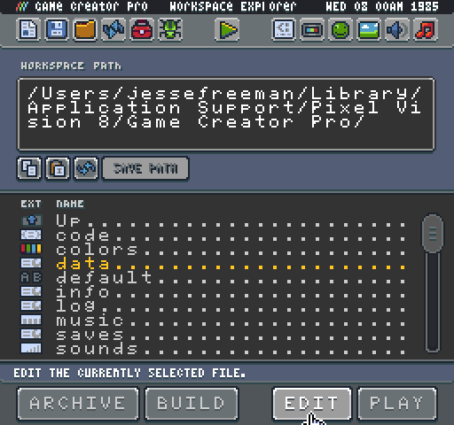
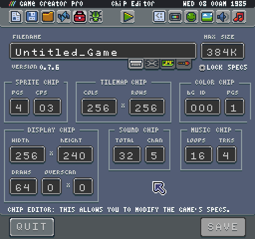
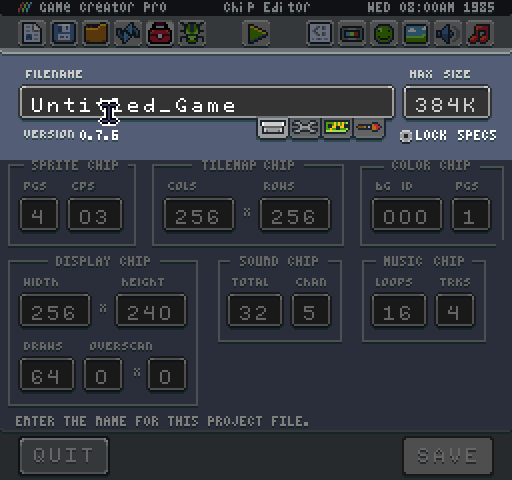
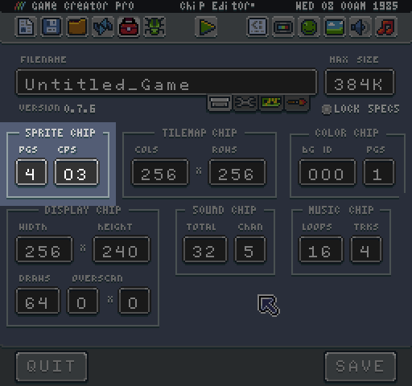
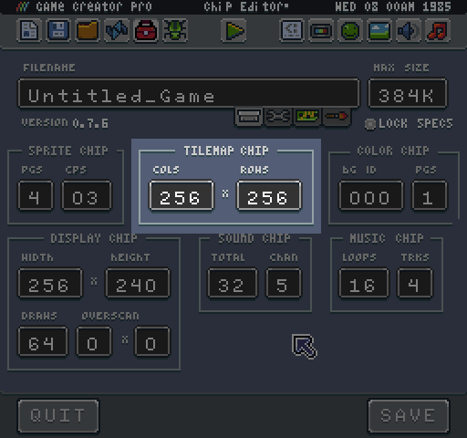
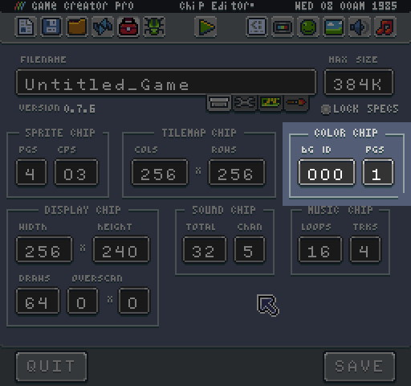
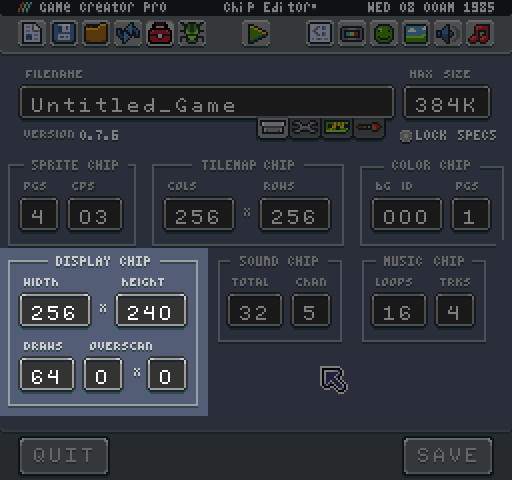
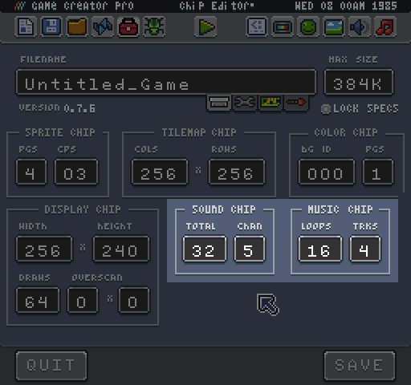

# The Chip Editor

The Chip Editor is a special tool designed for making changes to the game and its specs. This tool not only allows you to change the name, type and size of a game but you can also tweak each of the values for chip properties.

You can launch the Chip Editor by double-clicking on a game’s data.json file from inside of the Workspace Explorer Tool.

Once the Chip Editor launches, you will be presented with all the specs for the current game you are editing.

At the top of the tool, you will see input fields for changing the name, type and size of current game you are editing.

Most of the built-in templates lock the specs so they cannot be edited. To make changes, you will want to uncheck the Lock Specs option, and press save. Once unlocked, you will be able to modify any value in this tool. Here is an overview of each chip and their properties.

First up is the Sprite Chip. This controls the number of pages you have to store sprites in memory as well as the number of colors per sprite (CPS). 

Each page contains 256 sprites. You can have a maximum of 8 pages for a total of 2048 sprites. Colors Per Sprite dictate to the sprite importer how many colors to include for each 8x8 sprite graphic. You can set the CPS to 2 all the way up to 16. Systems like the original Nintendo and GameBoy allowed 4 colors per sprite, but one color was reserved for transparency. To simulate this, you would want to set the CPS to 3 since transparency is not counted as a color on each sprite.  

Up next is the Tilemap Chip. This allows you to change the width and height of the tilemap for your game.

The cols (width) and rows (height) are based on sprites. So a tilemap of 256 cols would be 2048 pixels wide. The tilemap can only be as small as the resolution allows. There is a maximum of 256 columns and 256 rows.

The color chip allows you to modify the system-wide background color and the total number of color pages.

To change the default background color, just set a new color ID in the BG ID field. There are 64 colors per page with a total of 4 pages giving you a maximum of 256 colors.

The Display Chip manages the screen’s resolution, the number of sprites on the screen (draws) and overscan.

The maximum resolution a game can be is 256 x 240 pixels. When changing the resolution, the Game Creator will run at the default aspect ratio of 256 x 240 so your game will be scaled to fill the area and may have black bars. Draws represents the total number of sprites that can be on screen at any given time. Capping the draw calls can help optimize a game by caching the number of sprite draw requests the display expects to render on a given frame. You can remove the sprite cap by setting it to zero.

The last option on the Display Chip is the overscan. Overscan represents the area of the display that was cut off by old CRT televisions. Overscan was used in old 8-bit games to hide sprites off the screen until they were ready to be displayed. Setting this value will remove a single column and row of tiles (the width or height of a single sprite) from the display’s visible resolution. If you are resolution was 256 x 240, and you set the overscan to 1x1 the visible resolution would be 248 x 232.

The last two chips are the Sound and Music Chips. These represent the total number of sound effects a game can have and the channels plus the loops and track for making music.

While these two chips are independent of each other, the music chip depends on some of the sound chips settings. The channel value dictates how many active sounds can be played at once. The music chip can have a maximum of 4 tracks, but if the number of channels is lower, it will cap this value. Also, it is important to note that if you play a sound effect on the same channel that a loop is using for its track, the new sound will be played instead. If you want to have a dedicated channel just for sound effects, set the channels to 5 and play sound effects on the 5th channel, so it does not interfere with any music being played.


