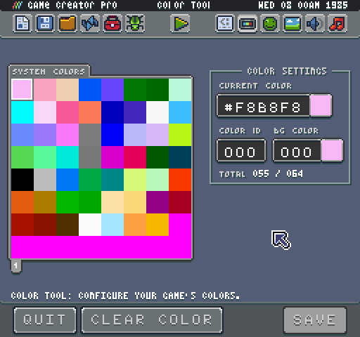
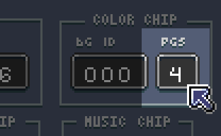
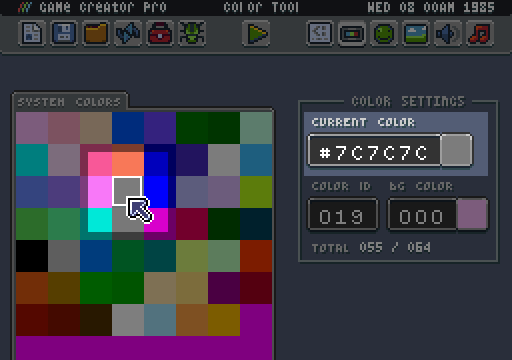
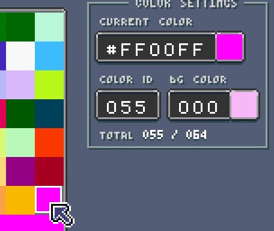

# Color Tool (Pro Only)

The Display Tool manages system colors. You can use this tool to define the system wide color palette and also set up individual palettes for swapping at run-time.

## Working with System Colors

Let’s focus on how to configure system colors first. Pixel Vision 8 can store a maximum of 256 colors. Colors are broken up into pages; each page displays 64 colors. Pages are simply a paradigm for navigating the system colors and helping better organize them in the tool. You can add or remove pages at any time by changing the PGS (Pages) filed value.

Modifying the number of pages shows or hides the picker’s pagination buttons.

You can navigate to a color by clicking on it in the picker or by changing the Color ID field value.

Color IDs begin at 0 and go up to 255. These IDs are necessary to know when you are trying to set them in the game. Colors are in hex. You can preview the currently selected color’s hex value in the Color Settings panel. To change the current color, enter a new hex value. After hitting return, the value is added to the Colors Chip and is the preview to the right of the field update as well. You can change any color from the picker, even colors that are not set yet. Pixel Vision 8 considers any color set to magenta (#FF00FF) transparent.

The Display tool shows you the total number of colors and what is total space is available in the Color Chip. If you try to use an empty color at run-time, it is masked off and treated as transparent. If the color is being used in the background, it shows through as magenta, which means the color is out of range for the display to show. Pixel Vision 8 also displays magenta when you attempt to access a color that is less than 0 or greater than the total number of colors.

You can have multiple instances of the same color; there is no restriction on duplicate colors or their order. For example, if you look at the Tilemap Demo, you can see it uses colors based on the GBoy system template but is repeating them in sets of 4.

Since Pixel Vision 8 doesn't enforce palettes, it may be hard to see in this demo. Each set of 4 colors represents a palette.

Organizing system colors in sets is an advanced technique that allows you simulate how 8-bit video game systems handled palette swapping. When combined with the colors per sprite value and the color offset used when drawing sprites, you can shift a sprite’s colors up and down by a fixed amount. For more information on how to use this technique, look at the section on simulating palettes.


