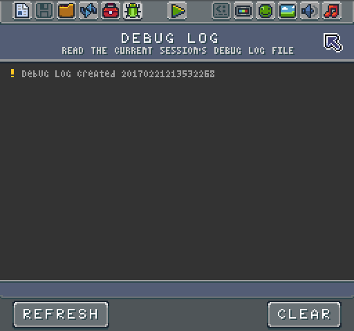
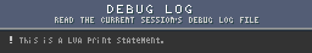
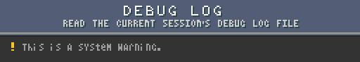
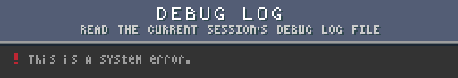

# Debug Tool

The Game Creator includes some basic tools for debugging your game. A lot of this revolves around the log file maintained by the Game Creator while it is running. You can preview this log at any time by opening up the Debug Tool.

Here you can read through the log.txt file and see the activity from the engine itself in the form of errors or Lua print() statements in your game. Here are the three types of messages you’ll see in the log:

There are two actions you can perform in the Debug Tool, refresh and clear. Both are self-explanatory. One thing to keep in mind, however, is that Game Creator automatically destroys the log.txt file when you shut down the application. If you want to save data from this file, you may need to open it up directly from the Workspace's tmp directory which is available when the Game Creator is running.

You can open this file in any text editor.


