# Display Tool

The Display Tool manages system colors and configuring the screen's resolution, overscan and total sprites shown per frame.

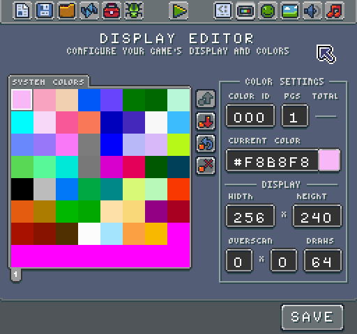

## Working with System Colors

Let’s focus on how to configure system colors first. Pixel Vision 8 can store a maximum of 256 colors. Colors are broken up into pages; each page displays 64 colors. Pages are simply a paradigm for navigating the system colors and helping better organize them in the tool. You can add or remove pages at any time by changing the PGS (Pages) filed value.

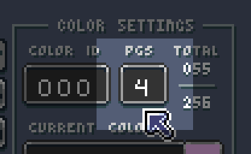

Modifying the number of pages shows or hides the picker’s pagination buttons.

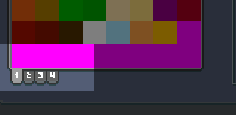

You can navigate to a color by clicking on it in the picker or by changing the Color ID field value.

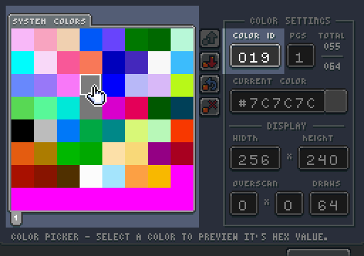

Color IDs begin at 0 and go up to 255. These IDs are necessary to know when you are trying to set them in the game. Colors are in hex. You can preview the currently selected color’s hex value below the Color ID and PGS field.

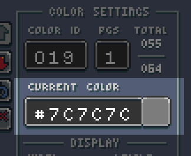

You can change the current color by entering a new hex value. After hitting return, the value is added to the Colors Chip and is the preview to the right of the field update as well. You can change any color from the picker, even colors that are not set yet. Pixel Vision 8 considers any color set to magenta (#FF00FF) transparent.

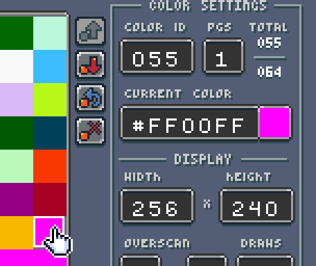

The Display tool shows you the total number of colors and what is total space is available in the Color Chip. If you try to use an empty color at run-time, it is masked off and treated as transparent. If the color is being used in the background, it shows through as magenta, which means the color is out of range for the display to show. Pixel Vision 8 also displays magenta when you attempt to access a color that is less than 0 or greater than the total number of colors.

You can have multiple instances of the same color; there is no restriction on duplicate colors or their order. For example, if you look at the Tilemap Demo, you can see it uses colors based on the GBoy system template but is repeating them in sets of 4.

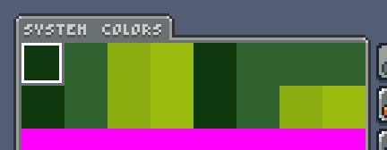

Since Pixel Vision 8 doesn't enforce palettes, it may be hard to see in this demo. Each set of 4 colors represents a palette.

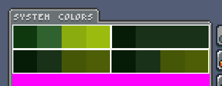

Organizing system colors in sets is an advanced technique that allows you simulate how 8-bit video game systems handled palette swapping. When combined with the colors per sprite value and the color offset used when drawing sprites, you can shift a sprite’s colors up and down by a fixed amount. For more information on how to use this technique, look at the section on simulating palettes.

The last set of tools related to managing system colors is the vertical row of buttons to the right of the color picker.

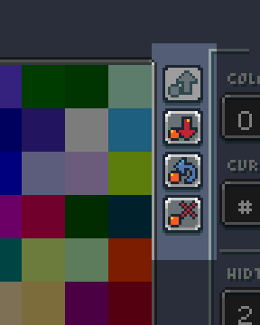

These buttons handle import (which is currently not enabled), export, revert and clear. Let’s look at how each button works:

* Import - while this feature is currently not functioning it allows you to sample any png in your game folder and pull out the colors from the file to populate the color table.

* Export - this allows your to generate a new colors.png file after you have made changes to the system colors. You must use this button if your want to save any color changes to your game project. Simply hitting save at the bottom right of the tool only saves configuration changes such as the number of pages.

* Revert - this reloads the colors.png file and replaces all of the colors with values found in that image.

* Clear - this clears the selected color. Clearing a color simply sets its value to magenta (#FF00FF)

## Configuring the Display

Now that we have talked about setting up the system colors, it is time to look at the display panel options.

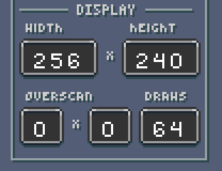

The display panel is broken up into 3 main groups. The first handles the width and height of the screen. By default, Pixel Vision 8’s native resolution is 256 x 240. While you are not limited to this resolution, all games are scaled to fit inside of it. That means if you change the resolution to 160 x 144, which is the resolution of the GBoy template, black bars appear at the top and bottom of your game.

The maximum resolution you can set a game to is 320x 240. It is important to note that while in windowed mode, games larger than 256 x 240 pixels are scaled down. In full-screen mode, games are displayed at their native resolution or as close as the engine can scale them to.

It is also important to note that resolutions higher than 256 x 240 may incur a performance penalty. At its default resolution, Pixel Vision 8 must display 61,440 pixels per frame. Larger resolutions increase this number exponentially and drastically slow down FPS. If you are having issues with a game running on lower powered systems, it is best to use a smaller resolution. Rendering fewer pixels means better performance.

Overscan allows you to simulate how 8-bit game systems handled rendering issues CRT monitors have around the edges of the display. The overscan fields tell the engine how many pixels to crop the right and bottom side of the screen. Leveraging Pixel Vision 8's overscan area is useful when trying to hide sprites off screen to keep them from wrapping. Older consoles had the ability to blank, or not render, a row or column of the display to account for this.

The game creator allows you to modify the overscan value directly. The first value represents the right border of the screen and the second represents the bottom. Each value removes 8 pixels which is a single row or column from the tilemap. 

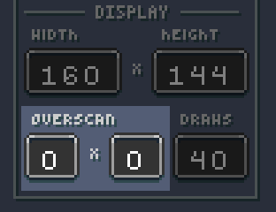

Let's look at a demo running at the GBoy resolution of 160 x 144 with overscan set to 0. If we change the overscan to 1 x 1, the far right column and bottom row are not rendered. 

Changing the overscan makes the resolution 152 x 136 since the Game Creator automatically scales the game to hide the overscan area. On its own, overscan cropping is hard to see. To help illustrate it, here are the 3 different overscan values next to each other.

On the left we have an overscan of 0 x 0 at a resolution of 160 x 144, in the middle overscan is set to 1 x 1 and on the right, the overscan is 4 x 4, the maximum value, which makes the visible resolution 128 x 112. To learn more about how overscan works and when to use it, check out the dedicated chapter in this book.

 

There is one field left to talk about, Draws. This field configures the maximum number of sprites the game can render at any given time. 

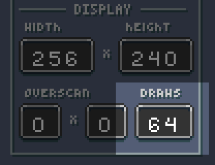

Original 8-bit consoles had hard limits on the number of sprites they could display during a single frame. Each one of the Game Creator templates has its value. By default, Pixel Vision 8 is 64. You can see how changing this value works by loading up the Sprite Stress Test Demo. Here you can see a screenshot of this demo attempting to render 64 sprites to the display in each frame.

If you change the value to 10, it automatically caps the sprites drawn to the screen even though the DrawSprite() method is being called 200 times per frame.

The total number of draw calls allows you to not only create more authentic-looking 8-bit games, but it also limits the amount of pixel data pushed to the renderer in each pass. The maximum you can set this value to in the Game Creator is 96. All of the Game Creator tools run at this setting.


