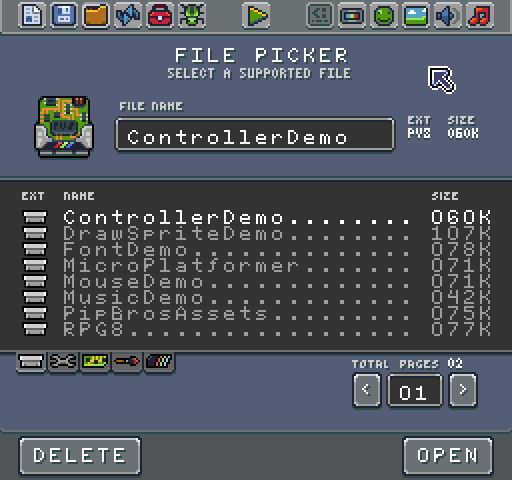
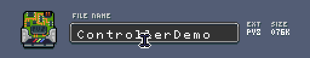
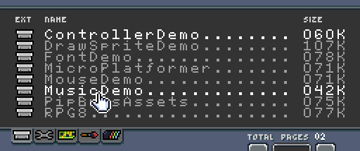
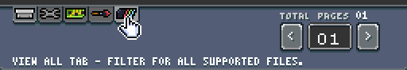
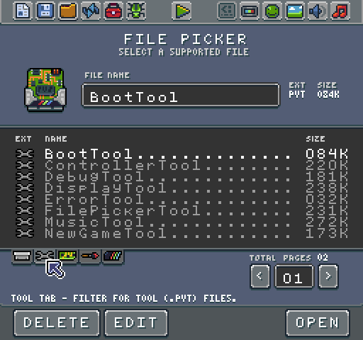
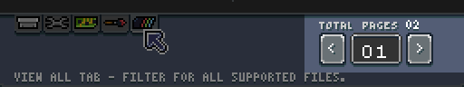
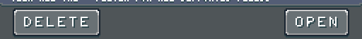
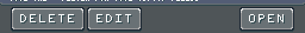

# The File Picker Tool

The File Picker Tool allows you to explore the contents of areas inside of the Workspace. The File Picker is designed to not only show supported file but to help you filter them by type.

The File Picker Tool is broken down into 3 main sections: currently selected file’s metadata, file picker area, and action bar.

The first thing we should look at is the currently selected file metadata:

This editor allows you to rename a file, view its extension, and its archived size. Renaming a file can not be undone, so be careful when changing file names, especially ones that Game Creator specifically relies on like system templates or tools. If the system detects that a core tool or file is missing when booting up, it automatically recreates it.

Next up is the file picker itself which contains three main parts: the picker, the filter, and the page navigator. Let’s look at the picker first:

The picker can display two columns of file data for a total of 16 files. Each column shows the extension by icon, a name, and size in kilobytes. Selecting a file updates the editor above with the currently selected file’s data. Once a file is selected, the editor highlights and can not be selected.

Below the picker on the left-hand side is a filter tab. The filters allow you to views files by type:

From left to right:

1. Game Tab - Filter for game (.pv8) files.

2. Tool Tab - Filter for tool (.pvt) files.

3. System Tab - Filter for system template (.pvt) files.

4. Resource Pack Tab - Filter for resource packs (.pva) files.

5. View All Tab - Filter for all supported files.

By changing the filter, the picker displays a new list of files, and the first item in the list is automatically selected.

You can navigate through pages of files via the page picker:

This picker gives you options to move to the previous or next page as well as enter a specific page number you would like to display.

Finally at the bottom of the File Picker Tool is the action bar. This bar is contextual based on the type of file you have selected. For most files, you have an option to delete or open.

When you select a tool, the picker displays a new "edit" option in the bottom action bar:

It is important to note the difference between how the editor loads a game and a tool. When you select a file and press open, the Game Creator looks at its extension and decides where to load it. Games (.pv8) files are loading into the Workspace’s Game folder. Tools (.pvt) files, however, are loaded into a temporary folder, and once loaded into memory, the picker deletes the source files. System templates and Asset Packs are unique. Templates are copied over and replace the contents of the Game folder. The picker imports the contents of an Asset Pack into an existing project.

While you can use the File Picker Tool to launch any custom tools you have built, which is useful when they do not show up in the Toolbar, there are times when you may need to edit a tool. The contextual Edit button allows you to load a tool into the Game directory and run it like a game. When you go to save it, the Tool still retains its extension, so you can still save it as a tool. The option to edit a tool is a powerful feature that also allows you to view or modify the built-in tools.

The Game Creator was designed to be an open system. You are encouraged to look through the source code of all of the included projects to see how they work and modify them as you want. If a particular tool does not suit your needs, go ahead and modify it or build your own. While the code is open to view, it is not free to re-distribute. Please respect the license at the top of the tool code.lua file. 

If a tool is marked to "not distribute," especially when it is part of Game Creator Pro, it would be better to make your tool from scratch and borrow what you need.


