# Music Tool (Pro Only)

The Game Creator’s built-in music tool not only allows you to create music from scratch or edit existing loops, but it can also generate random music to help get you started. This is what you are presented with when loading up a new song for the first time.

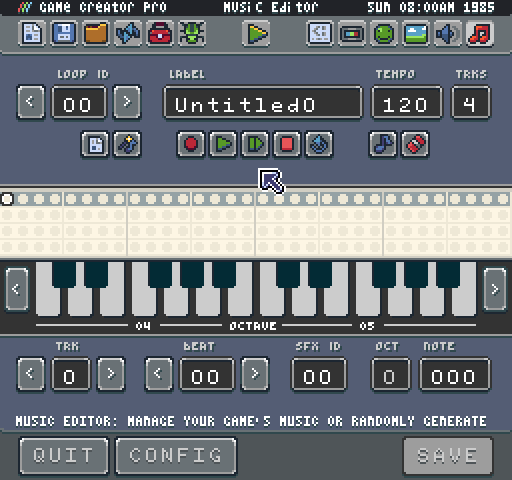

The Music Editor is divided into 4 different zones. The first zone focuses on navigating between loops, which are smaller parts of a song, naming a loop and changing the speed (tempo) as well as the number of tracks.

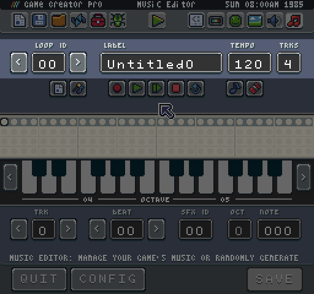

The next is the tool focuses on playback. Here you will find icons for creating a new song (which also clears an existing one), generating a new song, recording, single play, loop play, stop, rewind, note edit mode and not ease mode.

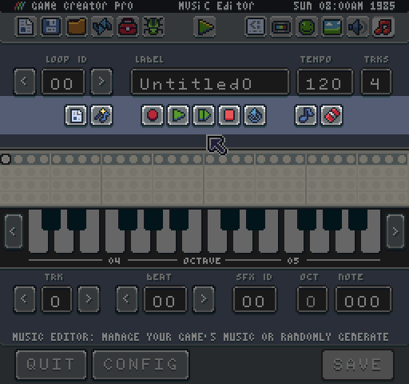

The main part of the Music Editor focuses on the tracker and music keys. This is where you will spend the majority of the time arranging and editing notes in the tracker. You can use the keys to add notes, and if you enter record mode, every time you enter a note, the tracker automatically advances to the next note.

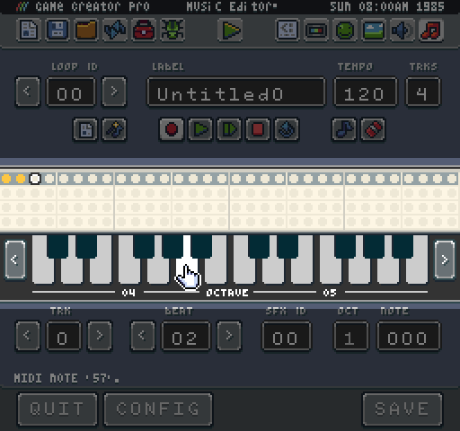

The final part of the Music Editor is the edit area. This is where you can change tracks, navigate to different beats in the tracker, change the sound effect ID for a track and modify the note value.

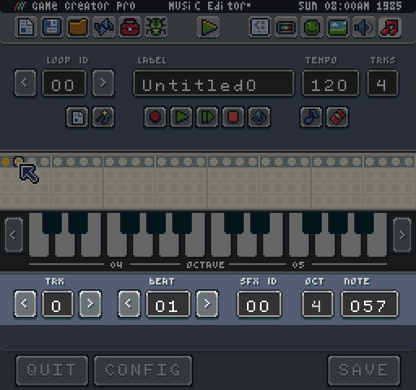

Now that you know about each of the different parts of the Music Editor let’s talk a little bit about adding notes and editing them. The primary tool for adding notes to the tracker is the keyboard. Each key represents a midi note value. You can change the octave of the keyboard with the arrows on the right and left sides of the keys.

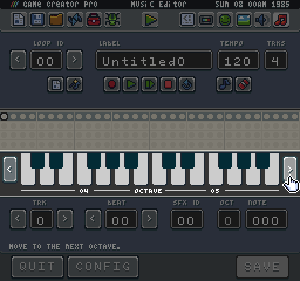

When you press a key, the note will be added to the currently selected beat in the tracker. You can use the mouse of the input fields at the bottom of the tool to change where notes are created.

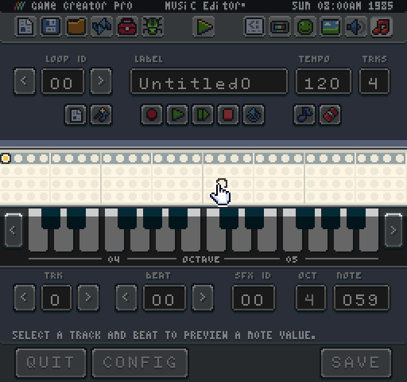

Each track has its sound effect ID. This is the sound that is used to play back the note. When you create a new game from one of the built-in templates, the first four sound effects are already set to musical instruments you will need in the music tool: melody, harmony, bass, and drums. This should help give you enough range to fill in each track. You can also modify the number of tracks to add limitations. Some of the templates such as the GBoy System only have 3 track available.

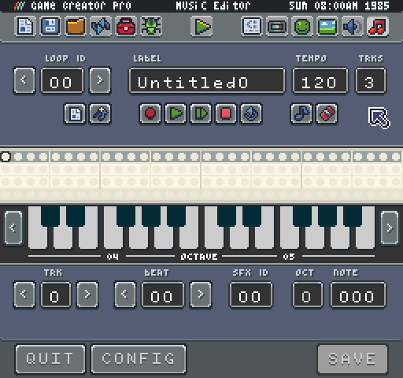

It is important to note that each track corresponds to a giving audio channel. That means if you are playing a loop that uses all 3 tracks and a sound effect is played on one of the channels, the music note will be ignored until the sound effect is done playing. If the sound effect is longer than a single note, the tracker may try to change the note value of the sound effect which could have some strange side effects. It is best to leave a single channel open just for sound effects. So if you are game has 3 channels, only put music notes on the first tracks. Likewise, you could add 5 channels and use all of the tracks in the Music Editor, it is up to you and how faithful to a system’s specs you want to stay.

If you are looking for a little help creating new loops, the Game Creator’s Music Tool can randomly generate a song for you. Simply press the music generator tool, and the track will be automatically populated with notes.

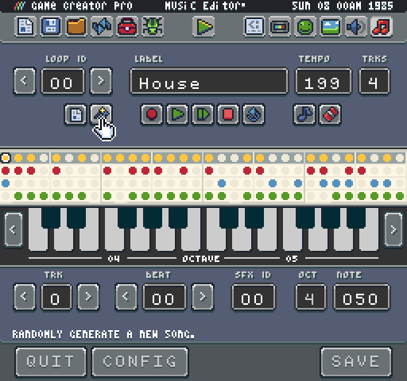

The music generator will use its default settings to automatically create notes on each track based on specific music patterns. It is also important to note that in the default configuration, the sound effects for each track will automatically be overwritten and new ones will be created specifically for the song. You can change the values of the Music Generator by pressing the config button.

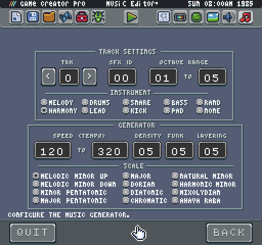

While most of these settings are functional, there is still some work to be done to finish everything up. Expect this to be fully working on the next release. That being said, you can go ahead and change each tracks sound effect ID, the octave range for its notes and the instrument template to use. By setting it to none, it will simply use the current sound effect settings and not generate new values. Use this if you have created custom instruments already.

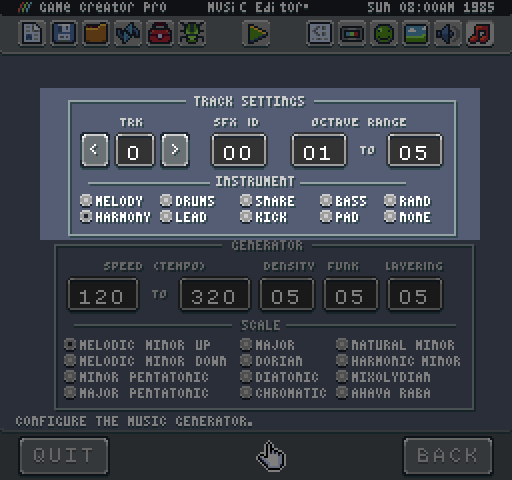

The next area allows you to change the global values of the generator itself such as the speed in tempo, the density, funk, and layer which alters the number and types of note per track and finally the musical scale to use.

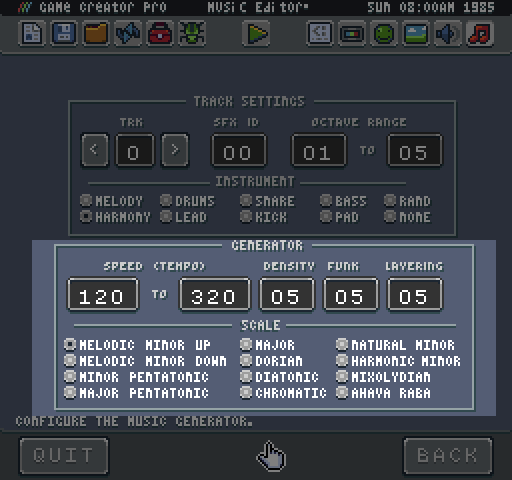

When you are done modifying the generator, hit the back button to return to the music tool. Changes you make to the music generator are not saved between sessions and will be lost when quitting the music tool. This will be addressed in future versions of the Game Creator.

When you have built a collection of loops, you can use the `PlaySong()` method and supply an array of loop IDs to create a single song.
