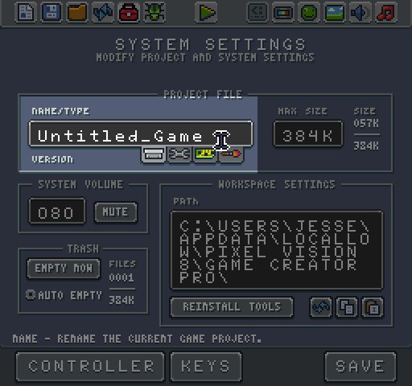

# New Game Tool

The New Game Tool is designed to simplify creating new projects. It presents a set of 5 built-in system templates and automatically copies the contents of them over to the Workspace’s Game folder when you select the New Game button.

Each system template was designed specifically around classic game system’s limitations. Simply select a system you want to use which updates the system spec preview below:

Each built-in templates is accessible from the File Picker as well.

Whether to chose a system template from the New Game Tool or the File Picker overwrites the contents of the Game directory with a copy of the selected template. Any changes you make to the newly created game only affect it and not the source template. The new game's name is "Untitled_Game" and when you save, it creates a new .pv8 file independent from the original template.  

You can also design your own system template, but only the five built-in ones show up in the New Project Tool.


