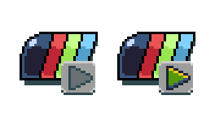
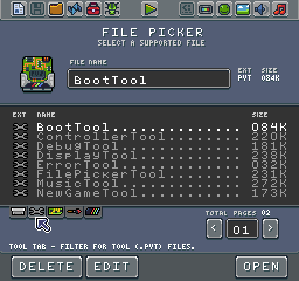

# The Included Tools

There are two versions of the Game Creator: Free and Pro. Both versions include the same basic set of tools for creating new projects, navigating the Workspace's files, saving and debugging. 

The Pro version includes specialized tools for working with colors, sprites, sound effects, music and more. In addition to the included tools, the Game Creator also offers a set of APIs and workflows for editing existing tools or building new tools from scratch.

Understanding how these tools work is critical to building Pixel Vision 8 games. While you can still make games by manually modifying the raw data files included in each game project, the tools contained in each version of the Game Creator help speed up development. In most cases, these tools offer up a more intuitive way of modifying the game's contents as well as customizing the underlying system limitations.


