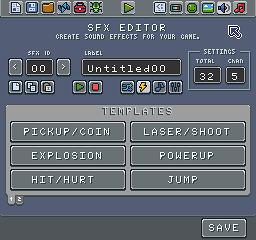
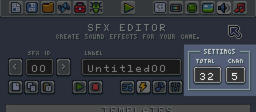
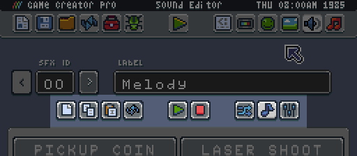
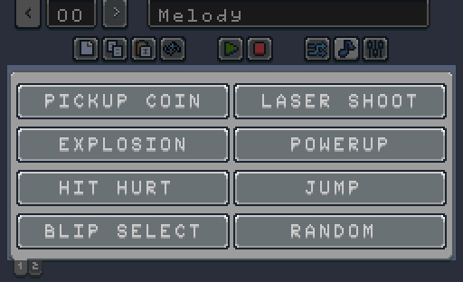
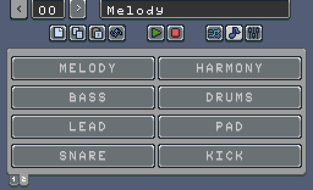
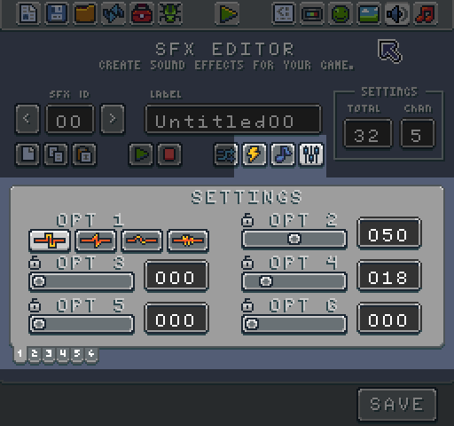

# SFX Tool

The SFX tool allows you to create sound effects for your game and instruments to be used in the music tool. At a high level, the SFX tool is optimized to make sound effect creation as easy as possible by offering templates to streamline the creation of sound assets. Here is what the tool looks like:

The tool is broken down into 4 main areas. The first area focuses on selecting songs.

You can use the left and right arrows to navigate the SFX IDs or enter an ID by hand to load a sound effect. Each sound can have a label which is there to help make organizing sound effects easier in the tool. The engine does not use the label; sound effects accessible by their ID in code.

The Sound Chip relies on two values from the Chip Editor, the total number of sound effect and the number of channels to play them back on. You can modify this in the 

The total field represents how many sound effects are available in the Sprite Chip. Sound effect IDs start at 0. If the total value is 32, the last sound effect ID is 31. Channels on the other hand control how many concurrent sounds can play at the same time.

Older game consoles had hard limits on the number of concurrent sounds that play at once. Pixel Vision 8 only allows a single sound effect to run per channel. Attempting to play a different sound effect on the same channel stop the previous sound effect and immediately play the new one. This value has the greatest effect when playing music which uses the same channels. Each music track plays on a single channel. You can not play a sound effect and a music track at the same time.

The next focus area is the sound effect toolbar.

Here is what each button does:

1. New - Create a new SFX or clear an existing one.

2. Copy - Copy SFX data.

3. Paste - Paste SFX data.

4. Play - Play the current SFX.

5. Stop - Stop the currently playing SFX.

6. Mutate - Randomize the current SFX properties.

7. Sounds - Select from a list of sound effect and instrument templates.

8. Settings - manually alter a SFX’s properties.

While most of these buttons are straightforward to use, the last 3 buttons change the SFX Editor functionality. These buttons toggle between the Sound/Instrument templates and editing the currently loaded sound effect's settings.

By default, the tool starts in the sound template mode. This mode configures the editor to display the sound effect generator templates. Each button generates a sound effect for you based on a theme. 

There are 8 sound effect templates:

* Create a randomized ‘pickup’ or coin sound effect.

* Create a randomized ‘explosion’ sound effect.

* Create a randomized ‘hit’ or ‘hurt’ sound effect.

* Create a randomized ‘laser’ or ‘shoot’ sound effect.

* Create a randomized ‘power-up’ sound effect.

* Create a randomized ‘jump’ sound effect.

* Create a randomized ‘blip’ or ‘select’ sound effect.

* Create a completely random sound effect.

On the second page there are templates to create musical instruments more suited to use with the Music Tool.

There are 8 musical instrument templates to choose from:

* Create a ‘melody’ instrument sound effect.

* Create a ‘bass’ instrument sound effect.

* Create a ‘lead’ instrument sound effect.

* Create a ‘harmony’ instrument sound effect.

* Create a ‘drums’ instrument sound effect.

* Create a ‘pad’ instrument sound effect.

* Create a ‘snare’ instrument sound effect.

* Create a ‘kick’ instrument sound effect.

Each time you press a template button, the SFX Editor Tool creates a new sound effect with a slight variation. Creating a new sound from a template overwrites the current sound so when you find something you like, be sure to change the sound ID before trying to generate a new sound effect. When you are happy with the changes, press the Save button at the bottom of the screen to write the sound effect data to your game’s file.

The last option in the Sound FX toolbar is the settings button. This displays more granular options for configuring the currently loaded sound.

This feature is still under development and may change in the future. If you roll over an option label, it tells you to want the setting does. Dragging a slider previews the change in real time. You can also enter a value in the field to have more granular control over what each value is.


