# Sprite Editor (Pro Only)

The Sprite Editor Tool allows you to preview sprites in memory. While editing sprites have is not enabled, there is still much functionality that this tool can offer when creating games. The most important being to see all of the sprites that are imported into the game and verifying that they are displayed correctly. Let's take a look at the Sprite Editor Tool's default layout.

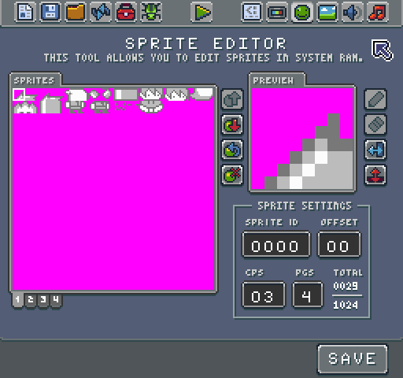

The tool is broken down into 3 parts: the sprite picker, the sprite editor, and the sprite settings. Let’s get started by talking about the picker. This tool is rather straightforward. Simply select a sprite you would like to preview. The picker displays a single page of sprites. Each page contains 256 sprites. You can have up to 8 pages of sprites in memory. You can change the total number of sprites in the Chip Editor.

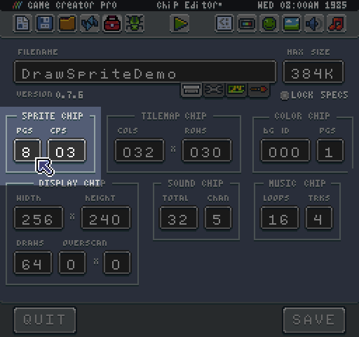

When you modify the number of sprite pages, new page tabs under the picker. Also, the tool displays the updates total sprites value. 

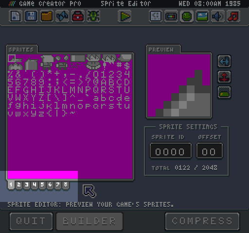

You can also see the total number of sprites in the game and the manimm that can be stored in memory inside of the sprite setting pane. 

The left number represents sprites that have pixel data and are not considered empty. The number on the right is the total number of sprites in memory. The tool calculates this value by multiplying the total number of sprites per page by the number of pages.

It is important to note that transparent color is represented by magenta (#FF00FF). If a sprite’s data contains no pixel data, either it is transparent or magenta, the engine ignores it and consider the sprite empty.

When you select a sprite, the tool displays its Sprite ID. If you type a value here, the picker selects the correct sprite. Sprites IDs begin at 0 and go up to the maximum number allowed by the total pages. If there are 4 pages, the last sprite is 1023. It is important to know the sprite ID to draw them to the display. Since Pixel Vision 8 automatically trims duplicate and empty sprites when it imports the sprites.png file, you can use this tool to double check which sprite is assigned to which ID.

On the topic of importing sprites, you want to pay attention to the CPS (Colors Per Sprint) field which can be changed in the Chip Editor. 

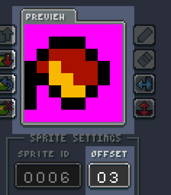

This field controls the total colors per sprite and impacts how a sprite is loaded into memory and drawn to the display. Older consoles had limitations on how many colors they could delay per sprite, and this value helps simulate this limitation. Changing this value forces the tool to re-import all of the sprites from the sprite.png with the new CPS value. Let’s take a look at what happens when we reduce the Draw Sprite Demo CPS value from 3 to 2.

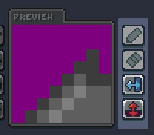

As you can see, the player’s hair is no longer displayed. The importer keeps track of each color as it parses a sprite from the sprite.png file and ignores additional colors beyond the CPS cap. Any color over the  CPS value is made transparent. This setting could have drastic effects on how Pixel Vision 8 imports your sprites. Lowering CPS could reduce the number of sprites imported at a run time. The maximum CPS value supported is 16.

On the flip side, CPS can help you better simulate 8-bit systems. The NES, for example, could only display three colors per sprite. While it did support a fourth background color, it was is shared across all sprites. You can easily simulate these limitations by setting the CPS value to 3. If you choose to set up the system colors in palette sets, you can get simulate palette swapping by changing the color offset to the CPS value when drawing sprites to the display. The Sprite Draw Demo’s system colors are set up in sets of three to simulate palettes.

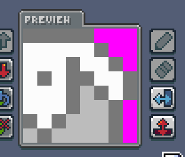

You can preview how sprites look when you shift its colors by changing the value in the Offset field. Each sprite is made up of a set of IDs that reference a system color. Changing the offset shifts the value up or down accordingly. When used in conjunction with the CPS value you can simulate palette shifting. To illustrate this, we can select the fireball sprite (ID 6) and change its offset to 3.

As you can see, the colors have been changed giving the fireball new colors. There are no constraints on changing the offset value. You can increment it by the CPS value or by any value. The Sprite Editor Tool allows you to test out how the offset affects your sprite at the run time. For more information on how to set up your game for palettes, check out the dedicated section in this book.

Let’s talk a little more about the sprite preview window. In addition to previewing a selected sprite, you can also make changes to it by using the vertical row of icons on the right-hand side. These icons allow you to flip horizontally, flip vertically, and preview the background color.

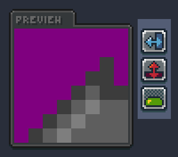

You can use the two flip buttons which allow you to preview what the sprite looks like when drawn to the display using either of the flip flags. These buttons do not alter the pixel data of the sprite; they simply are used to preview what these effects would have on a current sprite.

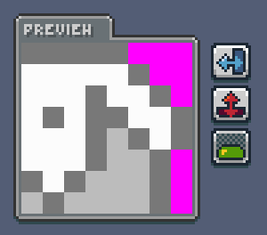

Finally, you can preview the sprite with the default background color by clicking the mask button.

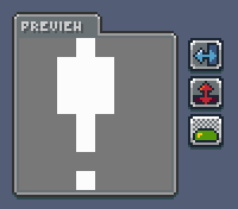

Pixel Vision 8 optimizes sprites for you during the import and export process. It attempts to remove duplicate and empty sprites from the sprite.png. You can use the Compress button to save the optimized sprite.png file. 

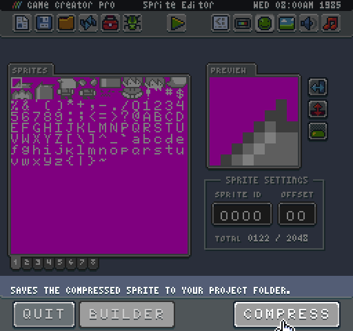

Here is an example of the sprite.png file included with the Draw Sprite Demo.

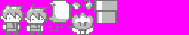

When Pixel Vision 8 imports sprites, the importer removes duplicate sprites and empty space to create the following image.

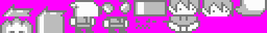

While this example does not have many duplicated sprites, the optimizations can sometimes make a huge difference in loading time. To learn more, check out the section on working with sprite data in the book.


