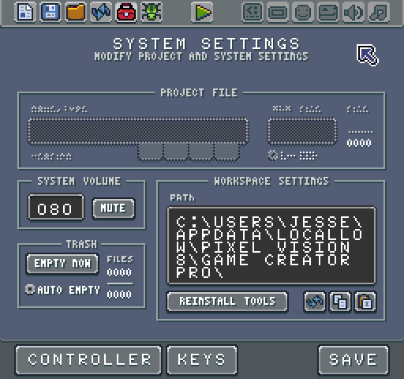
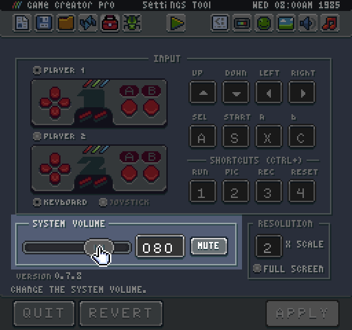
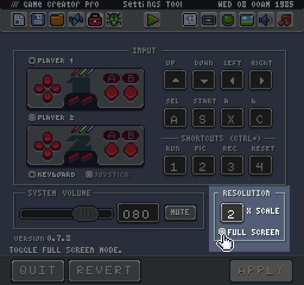

# System Settings Tool

​The System Setting Tool allows you to configure the global settings of the Game Creator in one place. You can also make changes to the controller and system shortcut keyboard mapping.

You can modify the system volume. This will not only affect the currently loaded game, but all sounds played by the Game Creator. 

You can also mute all sounds if you prefer to work in silence. The Game Creator saves the mute and volume values in the bios.json file at the root of your default Workspace path.

The last panel of the System Settings Tool controls the Game Creator’s resolution.

This allows you increase the scale of the Game Creator window or go into full screen mode. Any changes made to the resolution will need to be saved by clicking the Apply button at the bottom of the tool. The Game Creator will reload at the new resolution.


