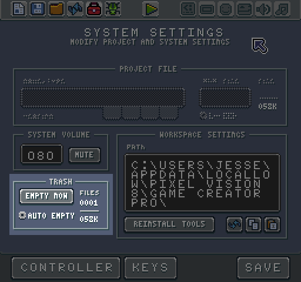
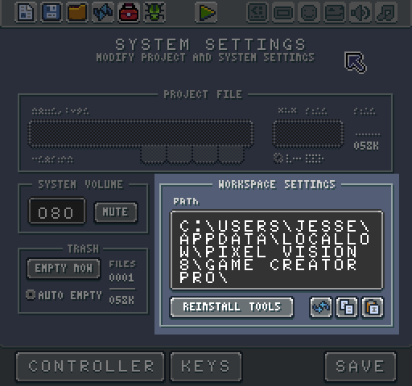
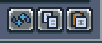
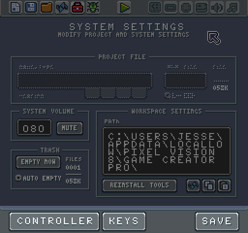

# System Settings Tool

​The System Setting Tool allows you to configure your currently open project and global settings in one place. You can also make changes to the controller and system shortcut keyboard mapping.

When a game is present in the Workspace's Game directory, its properties are editable from the System Settings Tool. Here you have access to the project's name, its file type, the version of Game Creator is was built with, the project's size and if the settings should be locked.

You can change a project from the default game (.pv8) type to a tool (.pvt), system template (.pvs) or asset pack (.pva). Also, you can modify how large a project can be. The size limitation is based the original template you use.

The last option in this panel allows you to lock a project's specs. This limits you from modifying any of the underlying system limitations to maintain a more authentic development environment. Currently, this feature is not implemented but will be set to true when added to the Game Creator.

Next, you can modify the system volume. This will not only affect the currently loaded game, but all sounds played by the Game Creator. 

You can also mute all sounds if you prefer to work in silence. The Game Creator saves the mute and volume values in the bios.json file at the root of your default Workspace path.

The System Settings Tool also allows you also to manage the Trash. By default, this is set to automatically empty every time you exit the Game Creator. 

The System Settings Tool also displays the current number of files in the trash as well as their size. You can manually clear the contents of the Trash directory by pressing the Empty Now button.

The last panel of the System Settings Tool is the Workspace Settings. This allows you to modify the default location of the Workspace Directory where all the default tools and templates installed on your computer, as well as were games and additional files are copied too when editing or playing games.

You can Reinstall the default tools or use the buttons on the right to modify the workspace path.

These buttons allow you to revert to the default path, copy the existing path or paste in a new valid path.

Finally, in the action bar below you can launch the Controller and Key Mapping Tools. 

These allow you change the default keyboard shortcuts for the Game Creator.


